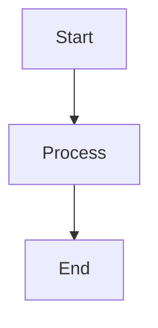

# Probo

Client repository for the Probo project, created based on the Probo template.

## Description
System for generating commercial proposals based on MDX files with dynamic content management and professional formatting.

## Tech Stack
- **Runtime:** Bun
- **Framework:** Next.js 14
- **Language:** TypeScript
- **Styling:** Tailwind CSS 4
- **MDX Processing:** @mdx-js/mdx
- **Theme Management:** next-themes
- **UI Components:** Shadcn/ui

## Project Structure
```
probo/
├── .github/workflows/      # GitHub Actions for automation
├── docs/                   # Project documentation
├── scripts/                # Automation scripts
├── src/                    # Application source code
│   ├── app/                # Next.js app directory
│   ├── components/         # React components
│   ├── lib/               # Utilities
│   └── types/             # TypeScript types
├── content/                # MDX content
├── public/                # Static files
└── external-storage/       # External storage (.env, database.db)
```

## Features
- MDX-based proposal templates
- Dynamic content injection
- Professional PDF generation
- Theme customization
- Responsive design
- Type-safe development
- Custom MDX components (Admonitions, Task Lists)
- Interactive Mermaid diagrams
- Table of Contents with scroll tracking

## Working with Template

This project is created based on the [Probo](https://github.com/GTFB/probo) template and configured to receive updates.

### Setting up Upstream for Git Pull

To receive updates from the original Probo template, you need to configure the upstream remote:

```bash
# Add upstream remote pointing to the original template
git remote add upstream https://github.com/GTFB/probo.git

# Verify remotes are configured correctly
git remote -v
# Should show:
# origin    https://github.com/GTFB/probo.git (fetch)
# origin    https://github.com/GTFB/probo.git (push)
# upstream  https://github.com/GTFB/probo.git (fetch)
# upstream  https://github.com/GTFB/probo.git (push)

# Fetch latest changes from upstream
git fetch upstream

# Merge upstream changes into your main branch
git checkout main
git merge upstream/main

# If conflicts occur in protected files, keep your local version
git checkout --ours content/*.mdx src/lib/settings.ts
git add content/*.mdx src/lib/settings.ts
git commit -m "Keep local content and settings after upstream merge"
```

**Note:** If you're working with a fork of the Probo template, replace the upstream URL with the original template repository URL.

### Protecting Local Files from Upstream Changes

This project includes `.gitattributes` configuration to protect your local content and settings from being overwritten when pulling from upstream:

- `content/*.mdx` - Your local MDX content files
- `src/lib/settings.ts` - Your project-specific settings
- `.env` and `database.db` - Local configuration files

When conflicts occur during upstream merges, your local versions will be preserved automatically.

### Getting Updates from Template

```bash
# Automatic way
./scripts/update-from-template.sh

# Manual way
git checkout update-from-template
git fetch upstream
git merge upstream/main
git push origin update-from-template
```

### Creating New Features

```bash
# Create feature branch
./scripts/create-feature.sh my-feature-name

# Develop feature and create PR to develop
```

### Branch Structure

- `main` - main branch (synchronized with template)
- `develop` - development branch
- `feature/*` - branches for new features
- `update-from-template` - branch for template updates

Detailed documentation: [docs/template-workflow.md](docs/template-workflow.md)

## Development
```bash
# Install dependencies
bun install

# Start development server
bun run dev

# Build for production
bun run build

# Run tests
bun test
```

## MDX Components

### Admonitions (Information Blocks)

Use the `<admonition>` component to create information blocks:

```mdx
<admonition type="info" title="Information">
This is an information block with blue color.
</admonition>

<admonition type="success" title="Success">
This is a success block with green color.
</admonition>

<admonition type="warning" title="Warning">
This is a warning block with yellow color.
</admonition>

<admonition type="danger" title="Danger">
This is a danger block with red color.
</admonition>
```

**Available types:**
- `info` - blue (information)
- `success` - green (success/advice)
- `warning` - yellow (warning)
- `danger` - red (danger/forbidden)

**Parameters:**
- `type` - block type (required)
- `title` - block title (optional)

### Task Lists (Checklists)

Checklists are automatically styled with icons:

```mdx
- [x] Completed task
- [ ] Uncompleted task
- [x] Another completed task
```

### Mermaid Diagrams

Interactive diagrams with zoom support:

```mdx

```

### UI Components

All Shadcn/ui components are available with `ui` suffix:

#### Accordion Components

```mdx
<accordionui type="single" collapsible>
  <accordionitemui value="item-1">
    <accordiontriggerui>What is this project about?</accordiontriggerui>
    <accordioncontentui>
      <p>This is a system for generating commercial proposals based on MDX files.</p>
    </accordioncontentui>
  </accordionitemui>
  <accordionitemui value="item-2">
    <accordiontriggerui>What technologies are used?</accordiontriggerui>
    <accordioncontentui>
      <p>Next.js 14, TypeScript, Tailwind CSS 4, and Shadcn/ui components.</p>
    </accordioncontentui>
  </accordionitemui>
</accordionui>
```

**Available accordion components:**
- `accordionui` - main accordion container
- `accordionitemui` - individual accordion item
- `accordiontriggerui` - clickable header (no underline on hover)
- `accordioncontentui` - collapsible content

#### Basic Components

```mdx
<!-- Buttons -->
<buttonui variant="default">Default Button</buttonui>
<buttonui variant="secondary">Secondary Button</buttonui>
<buttonui variant="outline">Outline Button</buttonui>
<buttonui variant="destructive">Destructive Button</buttonui>

<!-- Cards -->
<cardui>
  <h4>Card Title</h4>
  <p>Card content with automatic padding.</p>
  <buttonui variant="outline">Action Button</buttonui>
</cardui>

<!-- Badges -->
<badgeui variant="default">Default</badgeui>
<badgeui variant="secondary">Secondary</badgeui>
<badgeui variant="destructive">Destructive</badgeui>
<badgeui variant="outline">Outline</badgeui>

<!-- Avatar -->
<avatarui>
  <div className="w-10 h-10 rounded-full bg-primary flex items-center justify-center text-primary-foreground">
    JD
  </div>
</avatarui>

<!-- Breadcrumb -->
<breadcrumbui>
  <div className="flex items-center space-x-1 text-sm text-muted-foreground">
    <a href="#" className="hover:text-foreground">Home</a>
    <span>/</span>
    <a href="#" className="hover:text-foreground">Projects</a>
    <span>/</span>
    <span className="text-foreground">Current Project</span>
  </div>
</breadcrumbui>
```

#### Form Components

```mdx
<!-- Input -->
<inputui placeholder="Enter text..." />

<!-- Switch -->
<switchui />
<switchui defaultChecked />

<!-- Toggle -->
<tooggleui>Toggle Button</tooggleui>
<tooggleui pressed>Pressed Toggle</tooggleui>

<!-- Toggle Group -->
<toogglegroupui type="single">
  <tooggleui value="option1">Option 1</tooggleui>
  <tooggleui value="option2">Option 2</tooggleui>
  <tooggleui value="option3">Option 3</tooggleui>
</toogglegroupui>
```

#### Layout Components

```mdx
<!-- Separator -->
<separatorui />

<!-- Carousel -->
<carouselui className="w-full max-w-2xl mx-auto">
  <carouselcontentui>
    <carouselitemui>
      <cardui>
        <h4>Slide 1</h4>
        <p>This is the first slide of the carousel.</p>
      </cardui>
    </carouselitemui>
    <carouselitemui>
      <cardui>
        <h4>Slide 2</h4>
        <p>This is the second slide of the carousel.</p>
      </cardui>
    </carouselitemui>
  </carouselcontentui>
  <carouselpreviousui />
  <carouselnextui />
</carouselui>

<!-- Tabs -->
<tabsui defaultValue="tab1">
  <tabslistui>
    <tabstriggerui value="tab1">Account</tabstriggerui>
    <tabstriggerui value="tab2">Password</tabstriggerui>
    <tabstriggerui value="tab3">Settings</tabstriggerui>
  </tabslistui>
  <tabscontentui value="tab1">
    <h3>Account</h3>
    <p>Manage your account settings and preferences.</p>
  </tabscontentui>
  <tabscontentui value="tab2">
    <h3>Password</h3>
    <p>Change your password and security settings.</p>
  </tabscontentui>
  <tabscontentui value="tab3">
    <h3>Settings</h3>
    <p>Configure your application preferences.</p>
  </tabscontentui>
</tabsui>


<!-- Table -->
<tableui>
  <tablecaptionui>A list of your recent invoices.</tablecaptionui>
  <tableheaderui>
    <tablerowui>
      <tableheadui className="w-[100px]">Invoice</tableheadui>
      <tableheadui>Status</tableheadui>
      <tableheadui>Method</tableheadui>
      <tableheadui className="text-right">Amount</tableheadui>
    </tablerowui>
  </tableheaderui>
  <tablebodyui>
    <tablerowui>
      <tablecellui className="font-medium">INV001</tablecellui>
      <tablecellui>Paid</tablecellui>
      <tablecellui>Credit Card</tablecellui>
      <tablecellui className="text-right">$250.00</tablecellui>
    </tablerowui>
  </tablebodyui>
  <tablefooterui>
    <tablerowui>
      <tablecellui colSpan={3}>Total</tablecellui>
      <tablecellui className="text-right">$2,500.00</tablecellui>
    </tablerowui>
  </tablefooterui>
</tableui>
```

**All available UI components with `ui` suffix:**
- `accordionui`, `accordionitemui`, `accordiontriggerui`, `accordioncontentui`
- `buttonui`, `cardui`, `badgeui`, `avatarui`, `breadcrumbui`
- `inputui`, `switchui`, `checkboxui`, `selectui`, `labelui`
- `tooggleui`, `toogglegroupui`, `tabsui`, `tabslistui`, `tabstriggerui`, `tabscontentui`
- `separatorui`, `carouselui`, `carouselcontentui`, `carouselitemui`, `carouselpreviousui`, `carouselnextui`, `collapsibleui`, `dropdownmenuui`
- `chartstyleui`, `charttooltipui`, `charttooltipcontentui`, `chartlegendui`, `chartlegendcontentui`, `chartcontainerui`
- `videoplayerui`
- `tableui`, `tableheaderui`, `tablebodyui`, `tablefooterui`, `tableheadui`, `tablerowui`, `tablecellui`, `tablecaptionui`

## CSS Language Selectors

The project uses a special Tailwind CSS syntax for conditional content display based on the page language.

### Syntax

```css
[html[lang='LANGUAGE']_&]:CLASS
```

### Usage Examples

#### Hiding elements for specific languages

```jsx
// Hide element only for Russian language
<div className="[html[lang='ru']_&]:hidden">
  This content is hidden on Russian language
</div>

// Hide element only for English language  
<div className="[html[lang='en']_&]:hidden">
  This content is hidden on English
</div>
```

#### Showing elements only for specific languages

```jsx
// Show element only for Russian language
<div className="hidden [html[lang='ru']_&]:block">
  This content is visible only on Russian language
</div>

// Show element only for English language
<div className="hidden [html[lang='en']_&]:block">
  This content is visible only on English
</div>
```

#### Combining with responsive classes

```jsx
// Hide on mobile devices for Russian language
<div className="[html[lang='ru']_&]:hidden sm:[html[lang='ru']_&]:block">
  Hidden on mobile, visible on desktop for Russian language
</div>

// Different styles for different languages
<div className="text-sm [html[lang='ru']_&]:text-base [html[lang='en']_&]:text-lg">
  Responsive text size depending on language
</div>
```

#### Multiple languages

```jsx
// Hide for multiple languages
<div className="[html[lang='ru']_&]:hidden [html[lang='de']_&]:hidden">
  Hidden for Russian and German languages
</div>

// Show only for specific languages
<div className="hidden [html[lang='en']_&]:block [html[lang='es']_&]:block">
  Visible only for English and Spanish languages
</div>
```

### Supported Languages

The project supports the following languages (defined in `src/i18n.ts`):

- `en` - English
- `ru` - Русский  
- `es` - Español
- `fr` - Français
- `de` - Deutsch
- `it` - Italiano
- `pt` - Português
- `ja` - 日本語
- `ko` - 한국어
- `zh` - 中文
- `ar` - العربية
- `hi` - हिन्दी

### Advantages of this approach

1. **Pure CSS** - no JavaScript logic required
2. **Performance** - works at CSS level
3. **Readability** - clear syntax
4. **Flexibility** - can be combined with any Tailwind classes
5. **Automatic** - works with `lang` attribute in HTML

### Alternative approaches

If CSS selectors don't fit your needs, you can use:

```jsx
// JavaScript approach with useLocale hook
const { locale } = useLocale()
<div className={locale === 'ru' ? 'hidden' : 'block'}>

// Conditional rendering
{locale !== 'ru' && <div>Content for non-Russian language</div>}
```

## Font Styling Guidelines

### ✅ Correct Font Styling

Use Tailwind CSS utility classes for font styling:

```jsx
// ✅ CORRECT - Using Tailwind CSS classes
<h3 className="text-2xl font-semibold font-heading">
  Section Title
</h3>
```

### ❌ Incorrect Font Styling

Avoid mixing Tailwind classes with inline styles for the same property:

```jsx
// ❌ INCORRECT - Redundant and conflicting styles
<h3 className="text-2xl font-semibold font-heading" style={{ fontFamily: 'var(--font-heading)' }}>
  Section Title
</h3>

// ❌ INCORRECT - Inline styles override Tailwind classes
<h3 className="font-heading" style={{ fontFamily: 'Arial, sans-serif' }}>
  Section Title
</h3>
```

### Best Practices

1. **Use Tailwind classes first** - `font-heading`, `font-sans`, `font-mono`
2. **CSS variables only when needed** - for dynamic values or complex calculations
3. **Avoid redundancy** - don't set the same property in both class and style
4. **Consistent approach** - choose one method and stick to it throughout the project

### Available Font Classes

```jsx
// Font families
<div className="font-sans">Sans-serif text</div>
<div className="font-heading">Heading font</div>
<div className="font-mono">Monospace text</div>

// Font weights
<div className="font-normal">Normal weight</div>
<div className="font-medium">Medium weight</div>
<div className="font-semibold">Semibold weight</div>
<div className="font-bold">Bold weight</div>

// Font sizes
<div className="text-sm">Small text</div>
<div className="text-base">Base text</div>
<div className="text-lg">Large text</div>
<div className="text-xl">Extra large text</div>
<div className="text-2xl">2x large text</div>
```

## Environment Setup
- All terminal operations use Makefile commands
- File structure changes are automatically reflected in structure.md
