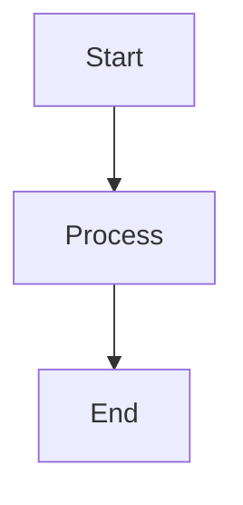

# Probo

Client repository for the Probo project, created based on the Probo template.

## Description
System for generating commercial proposals based on MDX files with dynamic content management and professional formatting.

## Tech Stack
- **Runtime:** Bun
- **Framework:** Next.js 14
- **Language:** TypeScript
- **Styling:** Tailwind CSS 4
- **MDX Processing:** @mdx-js/mdx
- **Theme Management:** next-themes
- **UI Components:** Shadcn/ui

## Project Structure
```
probo/
├── .github/workflows/      # GitHub Actions for automation
├── docs/                   # Project documentation
├── scripts/                # Automation scripts
├── src/                    # Application source code
│   ├── app/                # Next.js app directory
│   ├── components/         # React components
│   ├── lib/               # Utilities
│   └── types/             # TypeScript types
├── content/                # MDX content
├── public/                # Static files
└── external-storage/       # External storage (.env, database.db)
```

## Features
- MDX-based proposal templates
- Dynamic content injection
- Professional PDF generation
- Theme customization
- Responsive design
- Type-safe development
- Custom MDX components (Admonitions, Task Lists)
- Interactive Mermaid diagrams
- Table of Contents with scroll tracking

## Working with Template

This project is created based on the [Probo](https://github.com/GTFB/probo) template and configured to receive updates.

### Setting up Upstream for Git Pull

To receive updates from the original Probo template, you need to configure the upstream remote:

```bash
# Add upstream remote pointing to the original template
git remote add upstream https://github.com/GTFB/probo.git

# Verify remotes are configured correctly
git remote -v
# Should show:
# origin    https://github.com/GTFB/probo.git (fetch)
# origin    https://github.com/GTFB/probo.git (push)
# upstream  https://github.com/GTFB/probo.git (fetch)
# upstream  https://github.com/GTFB/probo.git (push)

# Fetch latest changes from upstream
git fetch upstream

# Merge upstream changes into your main branch
git checkout main
git merge upstream/main

# If conflicts occur in protected files, keep your local version
git checkout --ours content/*.mdx src/lib/settings.ts
git add content/*.mdx src/lib/settings.ts
git commit -m "Keep local content and settings after upstream merge"
```

**Note:** If you're working with a fork of the Probo template, replace the upstream URL with the original template repository URL.

### Protecting Local Files from Upstream Changes

This project includes `.gitattributes` configuration to protect your local content and settings from being overwritten when pulling from upstream:

- `content/*.mdx` - Your local MDX content files
- `src/lib/settings.ts` - Your project-specific settings
- `.env` and `database.db` - Local configuration files

When conflicts occur during upstream merges, your local versions will be preserved automatically.

### Getting Updates from Template

```bash
# Automatic way
./scripts/update-from-template.sh

# Manual way
git checkout update-from-template
git fetch upstream
git merge upstream/main
git push origin update-from-template
```

### Creating New Features

```bash
# Create feature branch
./scripts/create-feature.sh my-feature-name

# Develop feature and create PR to develop
```

### Branch Structure

- `main` - main branch (synchronized with template)
- `develop` - development branch
- `feature/*` - branches for new features
- `update-from-template` - branch for template updates

Detailed documentation: [docs/template-workflow.md](docs/template-workflow.md)

## Development
```bash
# Install dependencies
bun install

# Start development server
bun run dev

# Build for production
bun run build

# Run tests
bun test
```

## MDX Components

### Admonitions (Information Blocks)

Use the `<admonition>` component to create information blocks:

```mdx
<admonition type="info" title="Information">
This is an information block with blue color.
</admonition>

<admonition type="success" title="Success">
This is a success block with green color.
</admonition>

<admonition type="warning" title="Warning">
This is a warning block with yellow color.
</admonition>

<admonition type="danger" title="Danger">
This is a danger block with red color.
</admonition>
```

**Available types:**
- `info` - blue (information)
- `success` - green (success/advice)
- `warning` - yellow (warning)
- `danger` - red (danger/forbidden)

**Parameters:**
- `type` - block type (required)
- `title` - block title (optional)

### Task Lists (Checklists)

Checklists are automatically styled with icons:

```mdx
- [x] Completed task
- [ ] Uncompleted task
- [x] Another completed task
```

### Mermaid Diagrams

Interactive diagrams with zoom support:

```mdx

```

## Environment Setup
- All terminal operations use Makefile commands
- File structure changes are automatically reflected in structure.md
