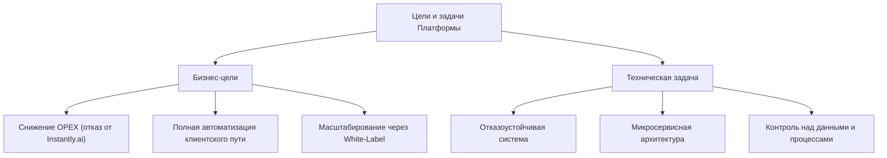
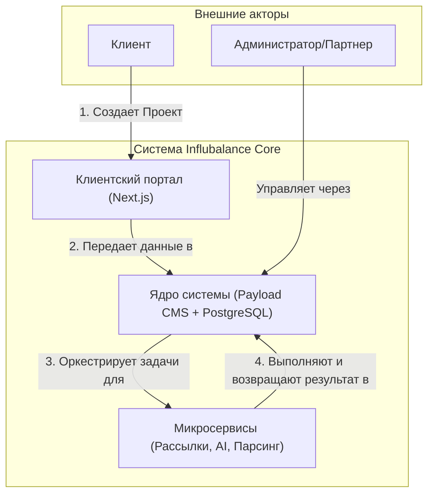
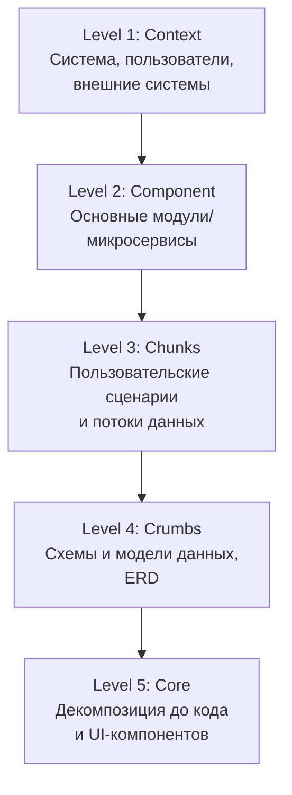
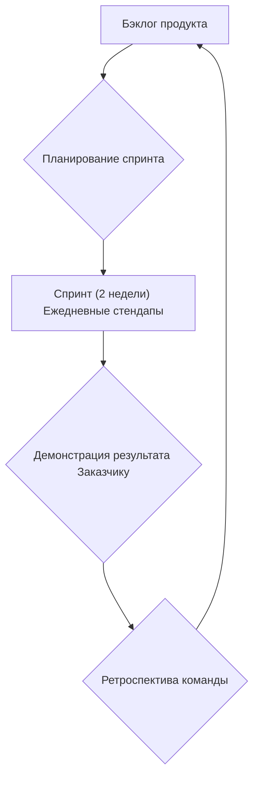
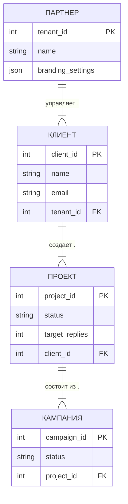

### 1. Общая информация

#### 1.1. Цели и задачи проекта

*   **Бизнес-цель:** Создать технологическую платформу для продукта Influbalance, которая позволит:
    1.  Снизить операционные расходы (OPEX) за счет отказа от сторонних сервисов (Instantly.ai).
    2.  Автоматизировать полный цикл работы с клиентом: от онбординга до получения результата.
    3.  Обеспечить техническую основу для масштабирования и запуска White-Label решения для партнеров.
*   **Техническая задача:** Разработать и внедрить отказоустойчивую, масштабируемую систему на базе микросервисной архитектуры для управления outreach-кампаниями.

#### 1.2. Используемые методологии

*   **Проектирование архитектуры:** Модель C5 (Context, Component, Chunks, Crumbs, Core) будет использоваться для визуализации и документирования архитектуры на разных уровнях абстракции. Диаграммы будут создаваться с использованием Mermaid для реализации подхода Architecture-as-Code.
*   **Разработка интерфейса:** Методология Atomic Design для создания консистентной и переиспользуемой библиотеки UI-компонентов.
*   **Управление проектом:** Agile-фреймворк Scrum. Проект разбивается на 2-недельные спринты с планированием, ежедневными стендапами, демонстрацией и ретроспективой.

#### 1.3. Глоссарий

*   **Клиент:** Конечный заказчик, который покупает услугу (бренд, стартап).
*   **Партнер (Тенант):** Агентство или фрилансер, использующий платформу по модели White-Label.
*   **Проект:** Заказ клиента, созданный через квиз. Включает в себя цели (например, 15 позитивных ответов), критерии подбора и бюджет.
*   **Кампания:** Конкретная outreach-активность в рамках Проекта, нацеленная на определенный сегмент инфлюенсеров.
*   **Позитивный ответ:** Ответ от инфлюенсера, классифицированный системой как явное выражение заинтересованности в сотрудничестве.

