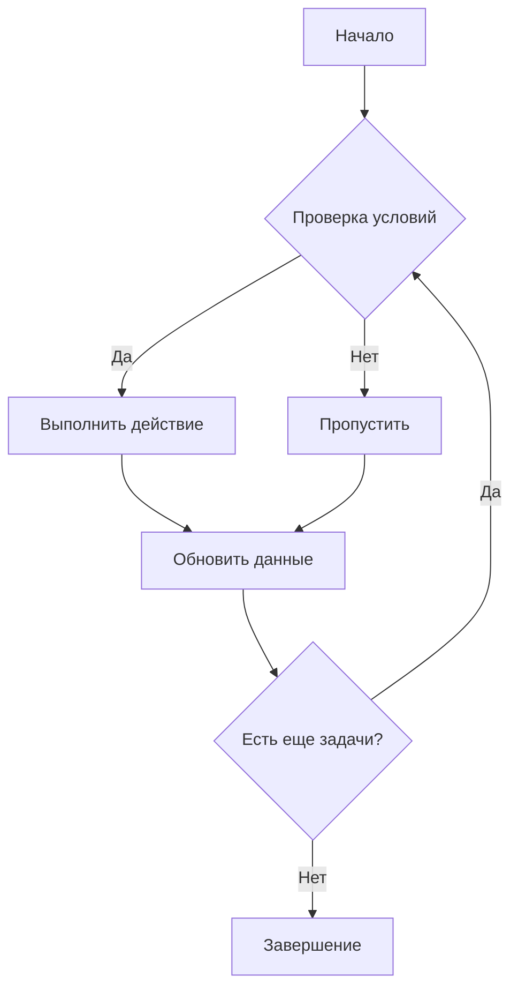
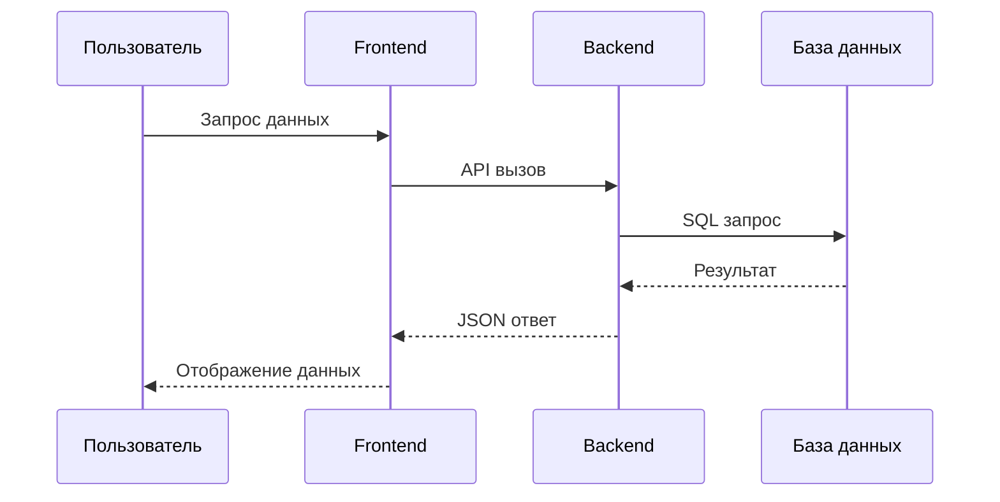
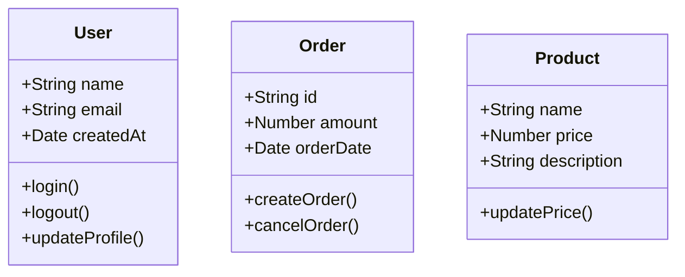
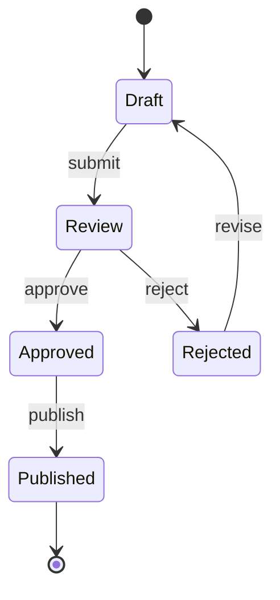
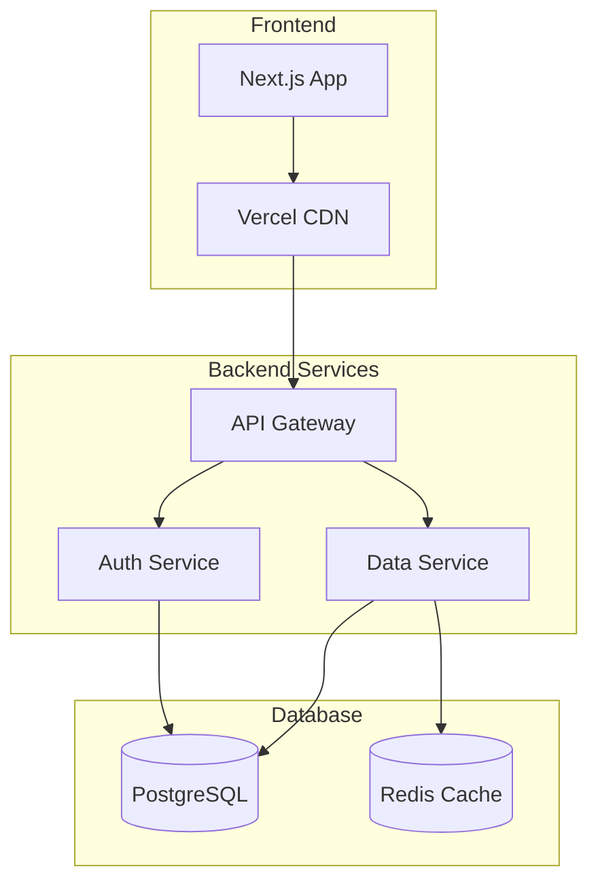

# Примеры стилей MDX контента

Эта страница демонстрирует все доступные стили и форматирование MDX контента, включая код с подсветкой синтаксиса.

## Заголовки всех уровней

### Заголовок третьего уровня

#### Заголовок четвертого уровня

##### Заголовок пятого уровня

###### Заголовок шестого уровня

## Форматирование текста

Это **жирный текст**, а это *курсив*. Также можно использовать ***жирный курсив***.

~~Зачеркнутый текст~~ и <mark>выделенный текст</mark>.

`Встроенный код` в тексте.

## Списки

### Маркированный список

- Первый элемент списка
- Второй элемент списка
  - Вложенный элемент
  - Еще один вложенный элемент
- Третий элемент списка

### Нумерованный список

1. Первый пункт
2. Второй пункт
   1. Вложенный пункт
   2. Еще один вложенный пункт
3. Третий пункт

### Маркированный и нумерованный список

*   **Выделение:** Описание:
    1.  Пункт 1.
    2.  Пункт 2.
    3.  Пункт 3.
*   **Выделение:** Конец.

### Список задач

- [x] Выполненная задача
- [ ] Невыполненная задача
- [x] Еще одна выполненная задача

## Цитаты

> Это обычная цитата. Она может содержать несколько строк текста.
> 
> И даже несколько абзацев.

> ### Цитата с заголовком
> 
> Цитата может содержать заголовки и другое форматирование.

## Код с подсветкой синтаксиса

### JavaScript/TypeScript

```javascript
// Пример функции на JavaScript
function greetUser(name, age = 18) {
  const message = `Привет, ${name}! Тебе ${age} лет.`;
  console.log(message);
  return message;
}

// Использование функции
const user = {
  name: "Алексей",
  age: 25
};

greetUser(user.name, user.age);
```

### React компонент

```tsx
import React, { useState, useEffect } from 'react';

interface UserProps {
  name: string;
  age: number;
}

const UserCard: React.FC<UserProps> = ({ name, age }) => {
  const [isActive, setIsActive] = useState(false);

  useEffect(() => {
    console.log(`Пользователь ${name} загружен`);
  }, [name]);

  return (
    <div className={`user-card ${isActive ? 'active' : ''}`}>
      <h3>{name}</h3>
      <p>Возраст: {age}</p>
      <button onClick={() => setIsActive(!isActive)}>
        {isActive ? 'Деактивировать' : 'Активировать'}
      </button>
    </div>
  );
};

export default UserCard;
```

### CSS стили

```css
/* Пример CSS стилей */
.user-card {
  background: linear-gradient(135deg, #667eea 0%, #764ba2 100%);
  border-radius: 12px;
  padding: 20px;
  box-shadow: 0 4px 6px rgba(0, 0, 0, 0.1);
  transition: all 0.3s ease;
}

.user-card:hover {
  transform: translateY(-2px);
  box-shadow: 0 8px 15px rgba(0, 0, 0, 0.2);
}

.user-card.active {
  background: linear-gradient(135deg, #4facfe 0%, #00f2fe 100%);
}

@media (max-width: 768px) {
  .user-card {
    padding: 15px;
    margin: 10px;
  }
}
```

## Таблицы

| Название | Описание | Статус | Дата |
|----------|----------|--------|------|
| Проект A | Веб-приложение | ✅ Активен | 2024-01-15 |
| Проект B | Мобильное приложение | 🚧 В разработке | 2024-02-01 |
| Проект C | API сервис | ❌ Завершен | 2024-01-30 |

### Таблица с выравниванием

| Левый | Центр | Правый |
|:------|:-----:|-------:|
| Текст слева | Текст по центру | Текст справа |
| Еще текст | Еще текст | Еще текст |

## Ссылки и изображения

### Ссылки

- [Официальный сайт Next.js](https://nextjs.org/)
- [Документация MDX](https://mdxjs.com/)
- [Tailwind CSS](https://tailwindcss.com/)

### Изображения


## Горизонтальная линия

---


## Эмодзи и символы

🎉 🚀 💻 ⚡ 🔥 📱 🎨 🌟 ✨ 🎯

## Специальные символы

- `<` для меньше
- `>` для больше
- `&` для амперсанда
- `"` для кавычек
- `'` для апострофа

## Mermaid диаграммы

### Блок-схема процесса



### Диаграмма последовательности



### Диаграмма классов



### Диаграмма состояния



### Диаграмма развертывания



## HTML элементы

<div style="background: linear-gradient(45deg, #ff6b6b, #4ecdc4); padding: 20px; border-radius: 10px; color: white; text-align: center;">
  <h3>Кастомный HTML блок</h3>
  <p>Это пример использования HTML в MDX</p>
</div>

## Заключение

Этот файл демонстрирует все основные возможности форматирования MDX контента. Все стили должны корректно отображаться с подсветкой синтаксиса для кода.
