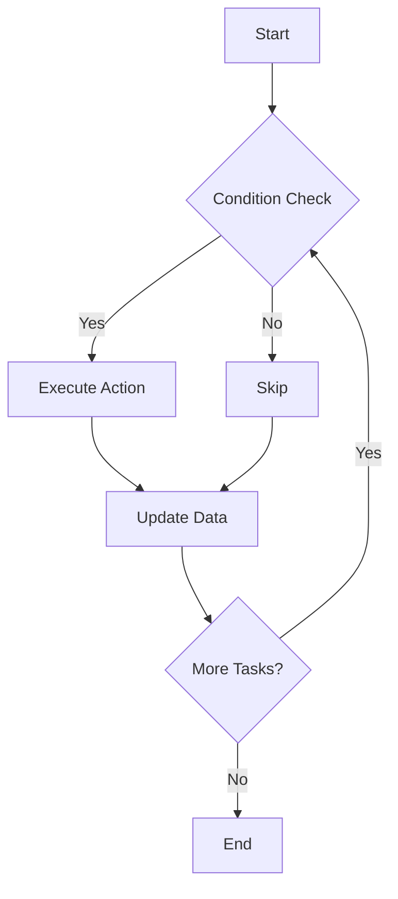
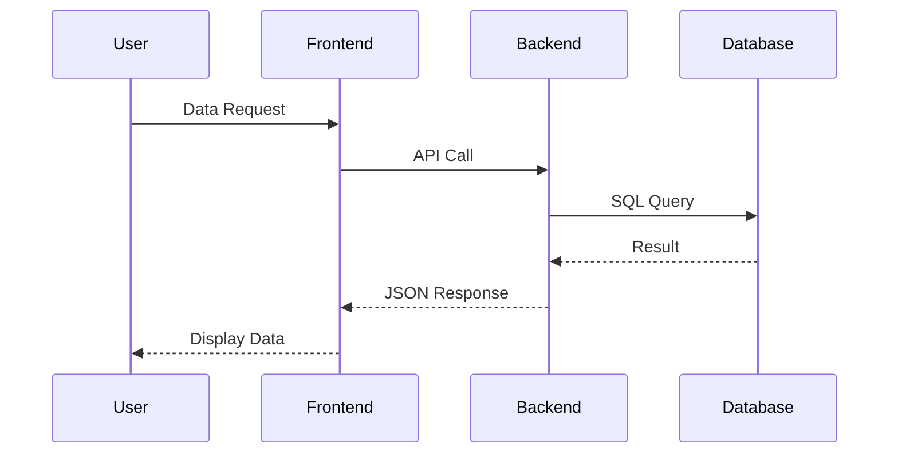
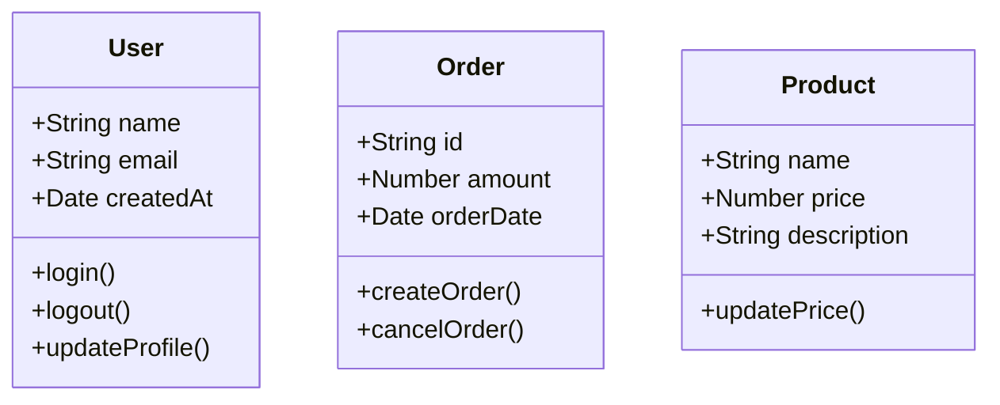
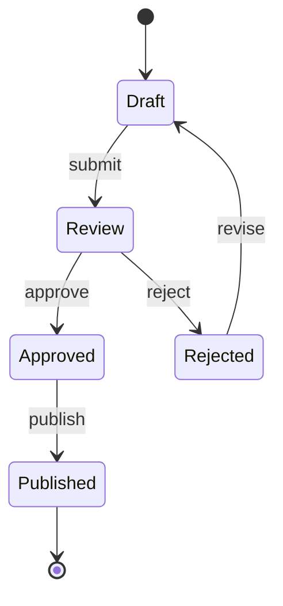
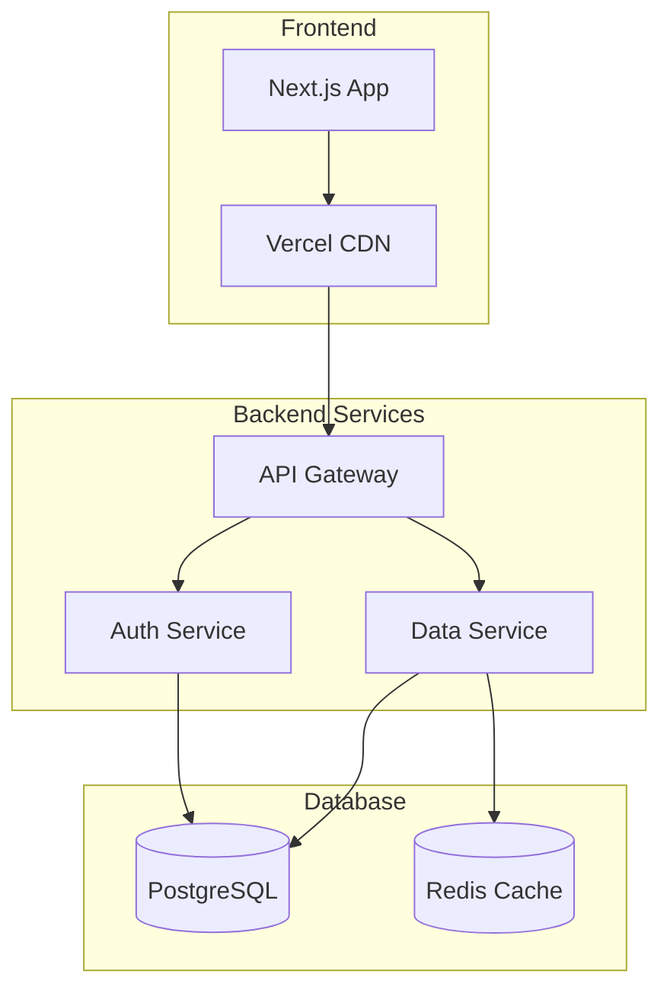

# MDX Content Styling Examples
slug: "mdx-content-styling-examples"

This page demonstrates all available styles and formatting for MDX content, including syntax-highlighted code.

## Headings of All Levels
slug: "headings-first"

### Third Level Heading
slug: "third-level-heading"

#### Fourth Level Heading
slug: "fourth-level-heading"

##### Fifth Level Heading
slug: "fifth-level-heading"

###### Sixth Level Heading
slug: "sixth-level-heading"

## Text Formatting
slug: "text-formatting"

This is **bold text**, this is <u>underlined text</u>, and this is *italic*. You can also use ***bold italic***, **<u>bold underlined</u>** and ***<u>bold underlined italic</u>***.

~~Strikethrough text~~ and <mark>highlighted text</mark>.

`Inline code` in text.

## Lists

### Bulleted List

- First list item
- Second list item
  - Nested item
  - Another nested item
- Third list item

### Checked List

- ✓ First list item
- ✓ Second list item
- ✓ Third list item

### Numbered List

1. First item
2. Second item
   1. Nested item
   2. Another nested item
3. Third item

### Mixed Bulleted and Numbered List

*   **Highlight:** Description:
    1.  Item 1.
    2.  Item 2.
    3.  Item 3.
*   **Highlight:** End.

### Task List

- [x] Completed task
- [ ] Uncompleted task
- [x] Another completed task

## Blockquotes

> This is a regular blockquote. It can contain multiple lines of text.
>
> And even multiple paragraphs.

> ### Blockquote with Heading
> A blockquote can contain headings and other formatting.
>
> — [Author Name](https://tailwindcss.com/)

## Syntax-Highlighted Code

### JavaScript/TypeScript

```javascript
// Example JavaScript function
function greetUser(name, age = 18) {
  const message = `Hello, ${name}! You are ${age} years old.`;
  console.log(message);
  return message;
}

// Using the function
const user = {
  name: "Alex",
  age: 25
};

greetUser(user.name, user.age);
```

### React Component

```tsx
import React, { useState, useEffect } from 'react';

interface UserProps {
  name: string;
  age: number;
}

const UserCard: React.FC<UserProps> = ({ name, age }) => {
  const [isActive, setIsActive] = useState(false);

  useEffect(() => {
    console.log(`User ${name} loaded`);
  }, [name]);

  return (
    <div className={`user-card ${isActive ? 'active' : ''}`}>
      <h3>{name}</h3>
      <p>Age: {age}</p>
      <button onClick={() => setIsActive(!isActive)}>
        {isActive ? 'Deactivate' : 'Activate'}
      </button>
    </div>
  );
};

export default UserCard;
```

### CSS Styles

```css
/* Example CSS styles */
.user-card {
  background: linear-gradient(135deg, #667eea 0%, #764ba2 100%);
  border-radius: 12px;
  padding: 20px;
  box-shadow: 0 4px 6px rgba(0, 0, 0, 0.1);
  transition: all 0.3s ease;
}

.user-card:hover {
  transform: translateY(-2px);
  box-shadow: 0 8px 15px rgba(0, 0, 0, 0.2);
}

.user-card.active {
  background: linear-gradient(135deg, #4facfe 0%, #00f2fe 100%);
}

@media (max-width: 768px) {
  .user-card {
    padding: 15px;
    margin: 10px;
  }
}
```

## Tables

| Name | Description | Status | Date |
|------|-------------|--------|------|
| Project A | Web Application | ✅ Active | 2024-01-15 |
| Project B | Mobile Application | 🚧 In Development | 2024-02-01 |
| Project C | API Service | ❌ Completed | 2024-01-30 |

### Table with Alignment

| Left | Center | Right |
|:------|:-----:|-------:|
| Left text | Center text | Right text |
| More text | More text | More text |

### Table Shadcn UI

<tableui>
  <tablecaptionui>A list of your recent invoices.</tablecaptionui>
  <tableheaderui>
    <tablerowui>
      <tableheadui className="w-[100px]">Invoice</tableheadui>
      <tableheadui>Status</tableheadui>
      <tableheadui>Method</tableheadui>
      <tableheadui className="text-right">Amount</tableheadui>
    </tablerowui>
  </tableheaderui>
  <tablebodyui>
    <tablerowui>
      <tablecellui className="font-medium">INV001</tablecellui>
      <tablecellui>Paid</tablecellui>
      <tablecellui>Credit Card</tablecellui>
      <tablecellui className="text-right">$250.00</tablecellui>
    </tablerowui>
    <tablerowui>
      <tablecellui className="font-medium">INV002</tablecellui>
      <tablecellui>Pending</tablecellui>
      <tablecellui>PayPal</tablecellui>
      <tablecellui className="text-right">$150.00</tablecellui>
    </tablerowui>
    <tablerowui>
      <tablecellui className="font-medium">INV003</tablecellui>
      <tablecellui>Unpaid</tablecellui>
      <tablecellui>Bank Transfer</tablecellui>
      <tablecellui className="text-right">$350.00</tablecellui>
    </tablerowui>
  </tablebodyui>
  <tablefooterui>
    <tablerowui>
      <tablecellui colSpan={3}>Total</tablecellui>
      <tablecellui className="text-right">$2,500.00</tablecellui>
    </tablerowui>
  </tablefooterui>
</tableui>

### Links

- [Next.js Official Website](https://nextjs.org/)
- [MDX Documentation](https://mdxjs.com/)
- [Tailwind CSS](https://tailwindcss.com/)

### Images


## Horizontal Line

---

## Emojis and Symbols

🎉 🚀 💻 ⚡ 🔥 📱 🎨 🌟 ✨ 🎯

## Special Characters

- `<` for less than
- `>` for greater than
- `&` for ampersand
- `"` for quotes
- `'` for apostrophe

## HTML Elements

<div style="background: linear-gradient(45deg, #ff6b6b, #4ecdc4); padding: 20px; border-radius: 10px; color: white; text-align: center; margin-bottom: 20px;">
  <h3>Custom HTML Block</h3>
  <p>This is an example of using HTML in MDX</p>
</div>

### Setup Instructions

<admonition type="info" title="Important">
Before starting work, make sure you have Bun installed and all dependencies.
</admonition>

<admonition type="success" title="Ready">
The project has been successfully configured and is ready to work!
</admonition>

<admonition type="warning" title="Attention">
Do not delete files from the `content/` folder without prior backup.
</admonition>

<admonition type="danger" title="Caution">
Incorrect configuration may lead to data loss.
</admonition>

### Block without title

<admonition type="info">
This block demonstrates the ability to create informational messages without a title. Useful for additional notes or explanations.
</admonition>

## UI Components Examples

### Accordion Components

<accordionui type="single" collapsible>
  <accordionitemui value="item-1">
    <accordiontriggerui>What is this project about?</accordiontriggerui>
    <accordioncontentui>
      <p>This is a system for generating commercial proposals based on MDX files with dynamic content management.</p>
    </accordioncontentui>
  </accordionitemui>
  <accordionitemui value="item-2">
    <accordiontriggerui>What technologies are used?</accordiontriggerui>
    <accordioncontentui>
      <p>Next.js 14, TypeScript, Tailwind CSS 4, and Shadcn/ui components.</p>
    </accordioncontentui>
  </accordionitemui>
</accordionui>

### Button Components

<buttonui variant="default">Default Button</buttonui>
<buttonui variant="secondary">Secondary Button</buttonui>
<buttonui variant="outline">Outline Button</buttonui>
<buttonui variant="destructive">Destructive Button</buttonui>

### Card Components

<cardui>
  <h4>Project Information</h4>
  <p>This card demonstrates the cardui component with custom content.</p>
  <buttonui variant="outline">Action Button</buttonui>
</cardui>

### Badge Components

<badgeui variant="default">Default</badgeui>
<badgeui variant="secondary">Secondary</badgeui>
<badgeui variant="destructive">Destructive</badgeui>
<badgeui variant="outline">Outline</badgeui>

### Avatar Components

<avatarui>
  <div className="w-10 h-10 rounded-full bg-primary flex items-center justify-center text-primary-foreground">
    JD
  </div>
</avatarui>

### Breadcrumb Components

<breadcrumbui>
  <div className="flex items-center space-x-1 text-sm text-muted-foreground">
    <a href="#" className="hover:text-foreground">Home</a>
    <span>/</span>
    <a href="#" className="hover:text-foreground">Projects</a>
    <span>/</span>
    <span className="text-foreground">Current Project</span>
  </div>
</breadcrumbui>

### Tabs Components

<tabsui defaultValue="tab1">
  <tabslistui>
    <tabstriggerui value="tab1">Account</tabstriggerui>
    <tabstriggerui value="tab2">Password</tabstriggerui>
    <tabstriggerui value="tab3">Settings</tabstriggerui>
  </tabslistui>
  <tabscontentui value="tab1">
    <h3>Account</h3>
    <p>Manage your account settings and preferences.</p>
  </tabscontentui>
  <tabscontentui value="tab2">
    <h3>Password</h3>
    <p>Change your password and security settings.</p>
  </tabscontentui>
  <tabscontentui value="tab3">
    <h3>Settings</h3>
    <p>Configure your application preferences.</p>
  </tabscontentui>
</tabsui>

### Separator Components

<separatorui></separatorui>

### Switch Component

<switchui></switchui>

### Carousel Components

<carouselui className="w-full max-w-2xl mx-auto">
  <carouselcontentui>
    <carouselitemui>
      <cardui>
        <h4>Slide 1</h4>
        <p>This is the first slide of the carousel.</p>
      </cardui>
    </carouselitemui>
    <carouselitemui>
      <cardui>
        <h4>Slide 2</h4>
        <p>This is the second slide of the carousel.</p>
      </cardui>
    </carouselitemui>
    <carouselitemui>
      <cardui>
        <h4>Slide 3</h4>
        <p>This is the third slide of the carousel.</p>
      </cardui>
    </carouselitemui>
  </carouselcontentui>
  <carouselpreviousui></carouselpreviousui>
  <carouselnextui></carouselnextui>
</carouselui>

### Toggle Components

<tooggleui>Toggle Button</tooggleui>
<tooggleui pressed>Pressed Toggle</tooggleui>

### Toggle Group Components

<toogglegroupui type="single">
  <tooggleui value="option1">Option 1</tooggleui>
  <tooggleui value="option2">Option 2</tooggleui>
  <tooggleui value="option3">Option 3</tooggleui>
</toogglegroupui>

## Mermaid Diagrams

### Process Flowchart



### Sequence Diagram



### Class Diagram



### State Diagram



### Deployment Diagram

