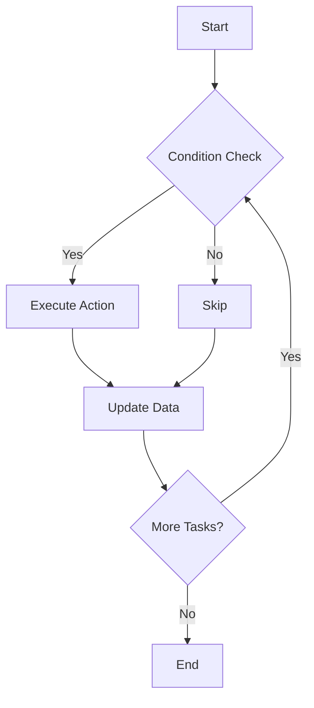
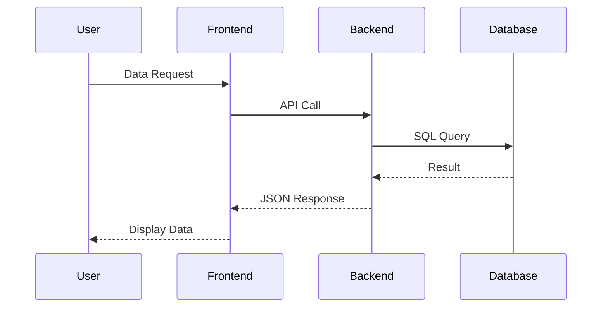
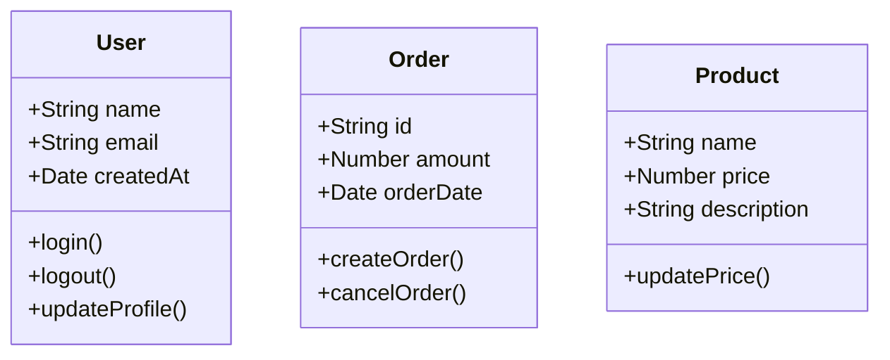
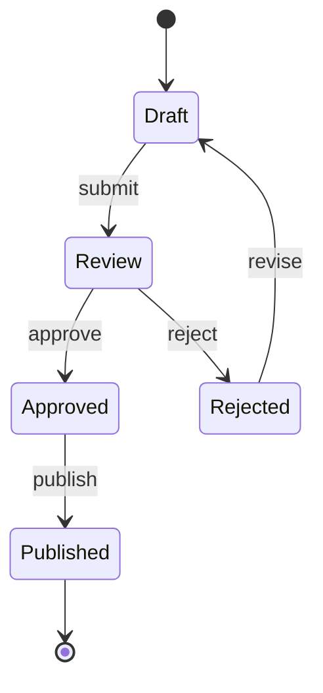
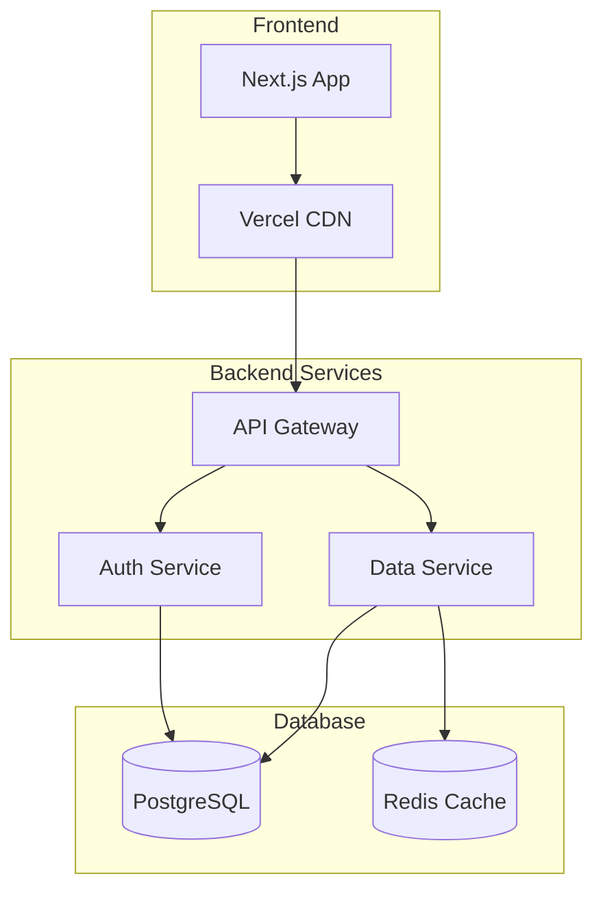

# MDX Content Styling Examples

This page demonstrates all available styles and formatting for MDX content, including syntax-highlighted code.

## Headings of All Levels

### Third Level Heading

#### Fourth Level Heading

##### Fifth Level Heading

###### Sixth Level Heading

## Text Formatting

This is **bold text**, this is <u>underlined text</u>, and this is *italic*. You can also use ***bold italic***, **<u>bold underlined</u>** and ***<u>bold underlined italic</u>***.

~~Strikethrough text~~ and <mark>highlighted text</mark>.

`Inline code` in text.

## Lists

### Bulleted List

- First list item
- Second list item
  - Nested item
  - Another nested item
- Third list item

### Numbered List

1. First item
2. Second item
   1. Nested item
   2. Another nested item
3. Third item

### Mixed Bulleted and Numbered List

*   **Highlight:** Description:
    1.  Item 1.
    2.  Item 2.
    3.  Item 3.
*   **Highlight:** End.

### Task List

- [x] Completed task
- [ ] Uncompleted task
- [x] Another completed task

## Blockquotes

> This is a regular blockquote. It can contain multiple lines of text.
> 
> And even multiple paragraphs.

> ### Blockquote with Heading
> 
> A blockquote can contain headings and other formatting.

## Syntax-Highlighted Code

### JavaScript/TypeScript

```javascript
// Example JavaScript function
function greetUser(name, age = 18) {
  const message = `Hello, ${name}! You are ${age} years old.`;
  console.log(message);
  return message;
}

// Using the function
const user = {
  name: "Alex",
  age: 25
};

greetUser(user.name, user.age);
```

### React Component

```tsx
import React, { useState, useEffect } from 'react';

interface UserProps {
  name: string;
  age: number;
}

const UserCard: React.FC<UserProps> = ({ name, age }) => {
  const [isActive, setIsActive] = useState(false);

  useEffect(() => {
    console.log(`User ${name} loaded`);
  }, [name]);

  return (
    <div className={`user-card ${isActive ? 'active' : ''}`}>
      <h3>{name}</h3>
      <p>Age: {age}</p>
      <button onClick={() => setIsActive(!isActive)}>
        {isActive ? 'Deactivate' : 'Activate'}
      </button>
    </div>
  );
};

export default UserCard;
```

### CSS Styles

```css
/* Example CSS styles */
.user-card {
  background: linear-gradient(135deg, #667eea 0%, #764ba2 100%);
  border-radius: 12px;
  padding: 20px;
  box-shadow: 0 4px 6px rgba(0, 0, 0, 0.1);
  transition: all 0.3s ease;
}

.user-card:hover {
  transform: translateY(-2px);
  box-shadow: 0 8px 15px rgba(0, 0, 0, 0.2);
}

.user-card.active {
  background: linear-gradient(135deg, #4facfe 0%, #00f2fe 100%);
}

@media (max-width: 768px) {
  .user-card {
    padding: 15px;
    margin: 10px;
  }
}
```

## Tables

| Name | Description | Status | Date |
|------|-------------|--------|------|
| Project A | Web Application | ✅ Active | 2024-01-15 |
| Project B | Mobile Application | 🚧 In Development | 2024-02-01 |
| Project C | API Service | ❌ Completed | 2024-01-30 |

### Table with Alignment

| Left | Center | Right |
|:------|:-----:|-------:|
| Left text | Center text | Right text |
| More text | More text | More text |

### Links

- [Next.js Official Website](https://nextjs.org/)
- [MDX Documentation](https://mdxjs.com/)
- [Tailwind CSS](https://tailwindcss.com/)

### Images


## Horizontal Line

---

## Emojis and Symbols

🎉 🚀 💻 ⚡ 🔥 📱 🎨 🌟 ✨ 🎯

## Special Characters

- `<` for less than
- `>` for greater than
- `&` for ampersand
- `"` for quotes
- `'` for apostrophe

## Mermaid Diagrams

### Process Flowchart



### Sequence Diagram



### Class Diagram



### State Diagram



### Deployment Diagram



## HTML Elements

<div style="background: linear-gradient(45deg, #ff6b6b, #4ecdc4); padding: 20px; border-radius: 10px; color: white; text-align: center; margin-bottom: 20px;">
  <h3>Custom HTML Block</h3>
  <p>This is an example of using HTML in MDX</p>
</div>

## Conclusion

This file demonstrates all the main MDX content formatting capabilities. All styles should display correctly with syntax highlighting for code.
