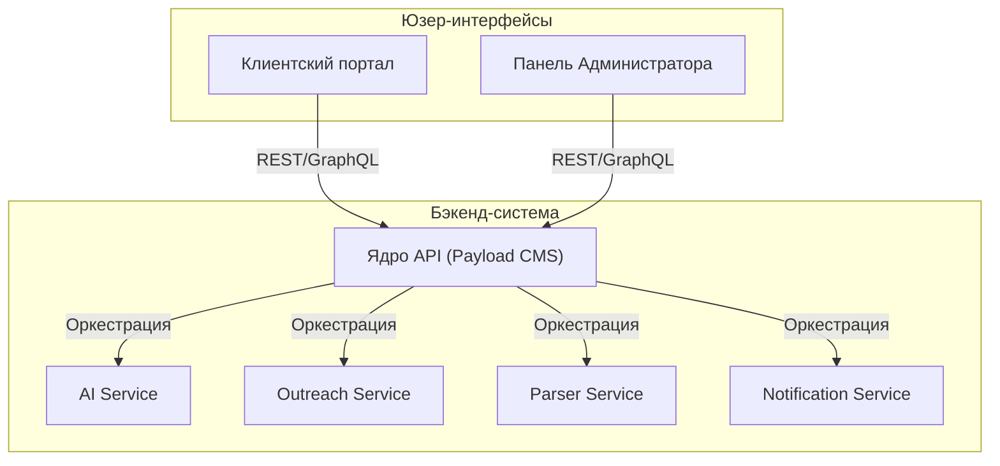
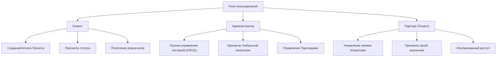
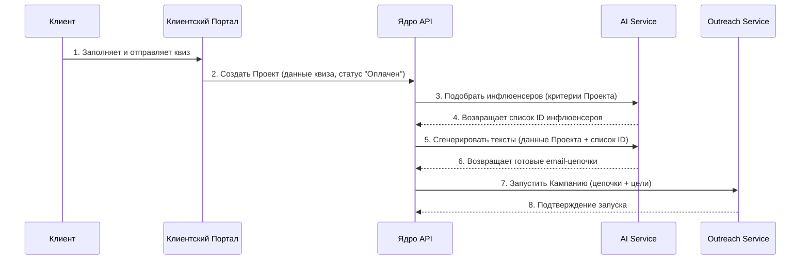

### **2. Функциональные требования**

#### **2.1. Модули системы**
Система состоит из следующих логических модулей (микросервисов и приложений), которые взаимодействуют через API:
1.  **Клиентский портал (Frontend):** Веб-приложение на Next.js для взаимодействия с клиентами.
2.  **Панель Администратора (Admin Panel):** Интерфейс на базе Payload CMS для управления всеми аспектами системы.
3.  **Ядро API (Core API):** API на базе Payload, предоставляющее доступ к данным и являющееся центральным хабом.
4.  **Сервис подбора и генерации (AI Service):** Микросервис для подбора инфлюенсеров и генерации текстов.
5.  **Сервис рассылок (Outreach Service):** Микросервис, отвечающий за отправку email-цепочек и трекинг ответов.
6.  **Сервис парсинга (Parser Service):** Микросервис для сбора и обновления базы инфлюенсеров.
7.  **Сервис уведомлений (Notification Service):** Микросервис для отправки real-time уведомлений в мессенджеры.

##### **Диаграмма компонентов (C5 - Level 2)**

#### **2.2. Роли пользователей**
*   **Клиент:**
    *   Просмотр главной страницы, кейсов, тарифов.
    *   Регистрация и аутентификация.
    *   Создание и оплата Проекта через квиз-форму.
    *   Просмотр статуса своего Проекта в личном кабинете.
    *   Получение уведомлений о позитивных ответах.
*   **Администратор (Команда Антона):**
    *   Полный CRUD-доступ ко всем сущностям: Клиенты, Проекты, Инфлюенсеры, Кампании.
    *   Просмотр системной аналитики и дашбордов.
    *   Ручной запуск/остановка Кампаний.
    *   Управление базой шаблонов для AI-генерации.
    *   Управление Тенантами (партнерами).
*   **Партнер (Тенант):**
    *   Доступ к кастомизированной (White-Label) версии Панели Администратора.
    *   Управляет только своими Клиентами и Проектами.
    *   Просматривает аналитику только в рамках своего тенанта.

##### **Карта ролей и их ключевых прав**

#### **2.3. Функциональные возможности по модулям**

**2.3.1. Клиентский портал**
*   **Онбординг:** Многошаговый квиз для сбора данных о Проекте.
*   **Оплата:** Интеграция со Stripe для приема депозитов за пакеты ответов.
*   **Личный кабинет:** Дашборд с ключевыми метриками Проекта (Цель / Текущий результат), список полученных позитивных ответов.

**2.3.2. Панель Администратора**
*   Управление инфлюенсерами: импорт, редактирование, просмотр истории контактов.
*   Управление проектами: просмотр всех активных проектов, редактирование критериев, ручная модерация.
*   Аналитика: дашборд с общей эффективностью платформы (конверсии, среднее время на закрытие проекта и т.д.).

**2.3.3. Сервис подбора и генерации (AI Service)**
*   API-эндпоинт для подбора инфлюенсеров: принимает критерии Проекта, возвращает список ID релевантных инфлюенсеров из БД.
*   API-эндпоинт для генерации текстов: принимает данные о продукте клиента и профиле инфлюенсера, возвращает готовую цепочку из 3 персонализированных писем.

**2.3.4. Сервис рассылок (Outreach Service)**
*   Подключение почтовых ящиков (Google, Microsoft) по SMTP/IMAP.
*   Автоматическое управление "прогревом" ящиков.
*   Запуск, постановка на паузу и остановка email-кампаний.
*   Трекинг ответов через IMAP.
*   AI-классификация ответов (Позитивный / Нейтральный / Негативный).
*   Автоматическая остановка цепочки после получения ответа.

**2.3.5. Сервис уведомлений (Notification Service)**
*   Интеграция с Telegram Bot API.
*   Отправка уведомлений клиенту и администратору при получении позитивного ответа.
*   Отправка сводных отчетов о статусе кампании.

##### **Последовательность обработки нового проекта (Sequence Diagram)**

