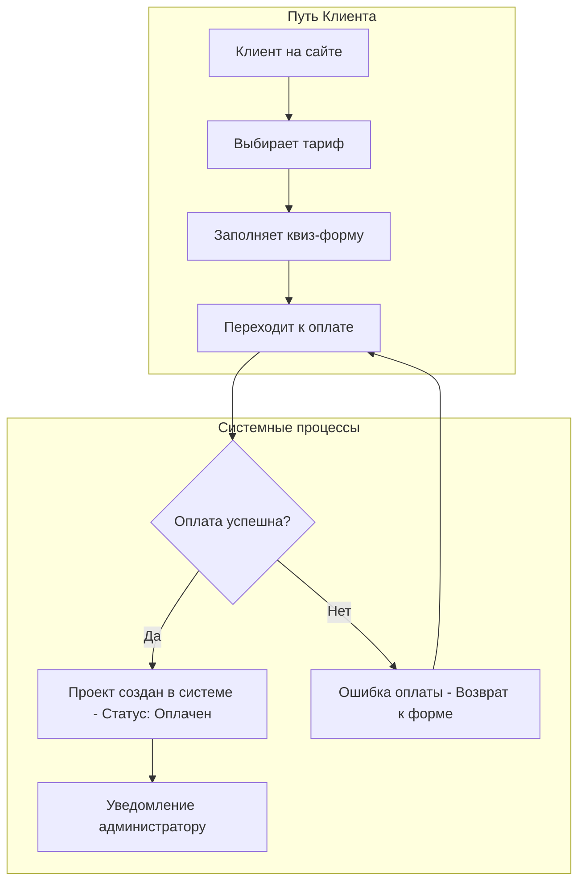
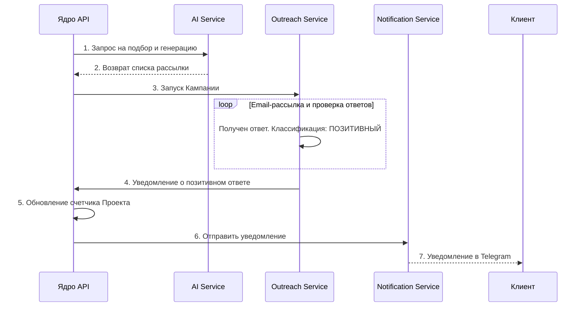
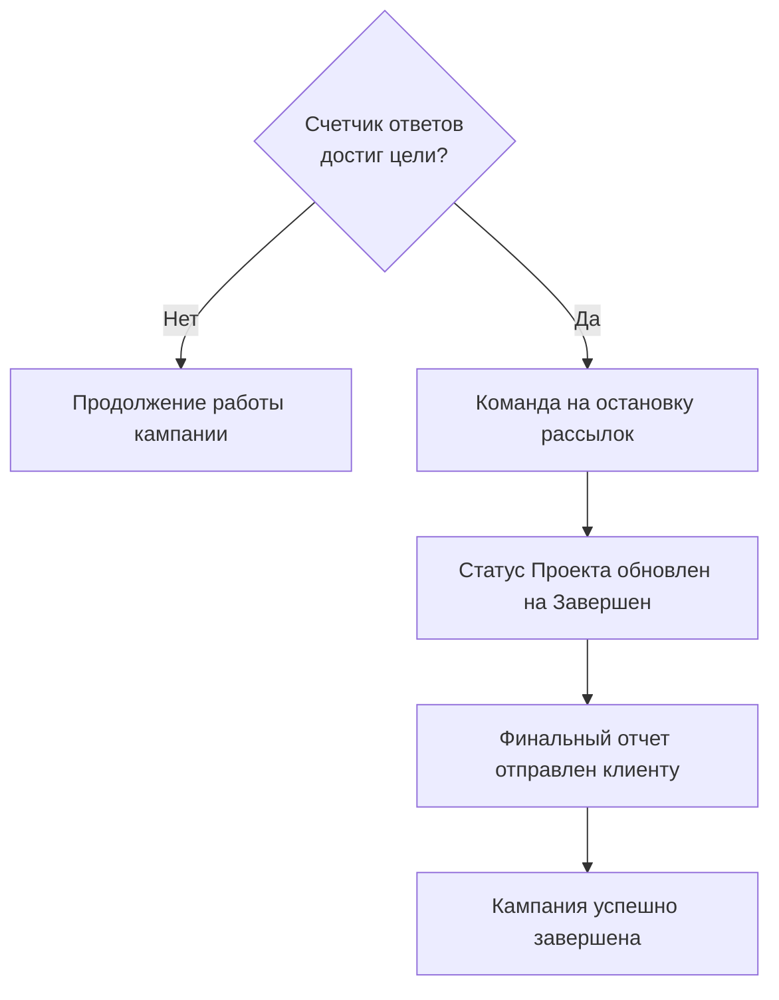

### 3. Пользовательские сценарии (Use Cases)
Этот раздел описывает ключевые end-to-end процессы, демонстрируя взаимодействие пользователя с системой и внутреннюю логику работы модулей для достижения бизнес-целей.

#### UC-01: Запуск кампании клиентом
Этот сценарий описывает путь нового клиента от выбора тарифа до момента, когда его заказ готов к автоматической обработке системой.

*   **Действия:**
    1.  Клиент выбирает на сайте тариф, например, "30 Positive Replies".
    2.  Заполняет многошаговый квиз, указывая все параметры кампании (ниша, гео, ЦА, модель сотрудничества и т.д.).
    3.  Переходит к оплате и вносит депозит в размере $240 через интегрированную форму Stripe.
    4.  После успешной оплаты система создает в базе данных "Проект" со статусом "Оплачен".
    5.  Администратор получает уведомление и видит новый проект в своей панели, после чего активирует его для запуска.

#### UC-02: Автоматическая работа системы
Сценарий описывает внутренний конвейер обработки активного проекта, от подбора инфлюенсеров до уведомления клиента о первом результате.

*   **Действия:**
    1.  Ядро API инициирует задачу для AI Service на подбор инфлюенсеров согласно критериям Проекта.
    2.  AI Service подбирает релевантных инфлюенсеров и генерирует для каждого персонализированную email-цепочку.
    3.  Ядро API передает готовые данные в Outreach Service с командой на запуск кампании.
    4.  Outreach Service начинает рассылку писем.
    5.  Система получает ответ от инфлюенсера, например: "Sounds interesting, what are the terms?".
    6.  Outreach Service с помощью AI-классификатора определяет ответ как "Позитивный".
    7.  Счетчик позитивных ответов в Проекте обновляется (например, `1 / 30`).
    8.  Notification Service мгновенно отправляет уведомление клиенту в Telegram с текстом ответа.

#### UC-03: Завершение кампании
Сценарий описывает логику автоматического завершения работы, когда поставленная клиентом цель достигнута.

*   **Действия:**
    1.  После получения очередного позитивного ответа счетчик в Проекте достигает целевого значения (например, `30 / 30`).
    2.  Ядро API фиксирует достижение цели.
    3.  Система автоматически отдает команду Outreach Service остановить все дальнейшие рассылки, связанные с этим Проектом.
    4.  Статус Проекта в базе данных меняется на "Завершен".
    5.  Notification Service отправляет клиенту финальный отчет и уведомление о завершении кампании.

