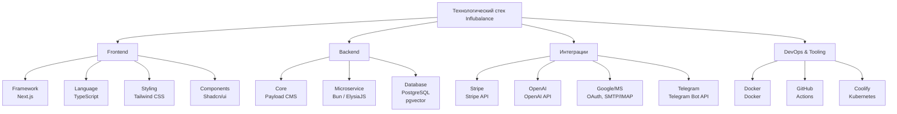

### 4. Технические требования

Этот раздел определяет технологический стек, архитектурные принципы и нефункциональные требования, которые обеспечат производительность, масштабируемость и безопасность платформы.

#### 4.1. Технологический стек
Выбранный стек оптимизирован для скорости разработки (DX), производительности (Performance) и типизированной безопасности (Type Safety).

*   **Frontend:** Next.js, TypeScript, Tailwind CSS, Shadcn/ui, Zustand.
*   **Backend (Ядро):** Payload CMS, Node.js, TypeScript.
*   **Микросервисы:** Bun, ElysiaJS, TypeScript.
*   **База данных:** PostgreSQL с расширением `pgvector` для семантического поиска.
*   **Интеграции:** Stripe API, OpenAI API, Telegram Bot API, Google/Microsoft APIs (OAuth, SMTP/IMAP).
*   **Инструменты:** Docker, Zod (валидация), React Hook Form, ESLint, Prettier.

#### 4.2. Архитектура

*   **Микросервисная архитектура:** Каждый ключевой бизнес-процесс (рассылка, AI-генерация, парсинг) вынесен в отдельный, независимый сервис. Это обеспечивает отказоустойчивость (падение одного сервиса не затронет остальные) и возможность независимого масштабирования.
*   **Мульти-тенантность (для White-Label):** Архитектура изначально проектируется с разделением данных по `tenant_id`. Все запросы к API и базе данных строго изолированы в рамках одного партнера, что является ключевым требованием для White-Label.
*   **Контейнеризация:** Все бэкенд-сервисы и база данных упаковываются в Docker-контейнеры. Это гарантирует идентичность окружений для разработки, тестирования и продакшена, исключая проблемы "у меня на машине все работало".

#### 4.3. Требования к производительности (нефункциональные)

*   **Время ответа API:** < 200 мс для 95% запросов (за исключением тяжелых AI-операций).
*   **Время загрузки клиентского портала (FCP - First Contentful Paint):** < 1.5 секунды.
*   **Масштабируемость:** Система должна быть способна обрабатывать до 100 одновременно запущенных кампаний, отправляя до 50 000 уникальных писем в сутки, с возможностью горизонтального масштабирования сервисов.

#### 4.4. Требования к безопасности

*   **Аутентификация и Авторизация:** JWT-токены для сессий. RBAC (Role-Based Access Control) на уровне API для разделения прав Клиента, Администратора и Партнера.
*   **Хранение данных:** Пароли пользователей хэшируются (bcrypt). Все внешние ключи API, токены и другие секреты хранятся в защищенном хранилище (например, Doppler, Vault или переменные окружения).
*   **Изоляция данных:** Жесткая фильтрация всех запросов к БД по `tenant_id` на уровне репозиториев данных, чтобы исключить любую возможность утечки данных между партнерами.
*   **Защита от веб-уязвимостей:** Валидация всех входящих данных на уровне API с помощью Zod для предотвращения инъекций. Применение стандартных практик защиты от XSS, CSRF.

#### 4.5. Инфраструктура и DevOps

*   **Хостинг:** Vercel для Frontend, кластер Kubernetes (GKE, EKS) или managed-сервисы (DigitalOcean Apps, Railway) для бэкенд-сервисов и БД.
*   **CI/CD:** Автоматизированные пайплайны на GitHub Actions для каждого пуша в основные ветки. Пайплайн включает: линтинг, запуск тестов, сборку Docker-образов и автоматический деплой на staging-окружение. Деплой на production - по ручному триггеру.

