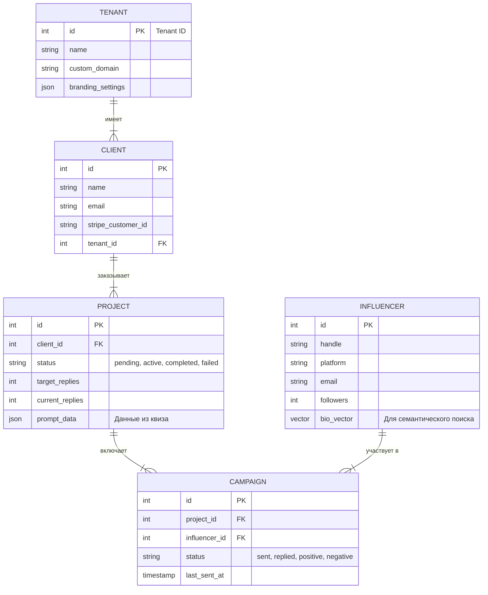
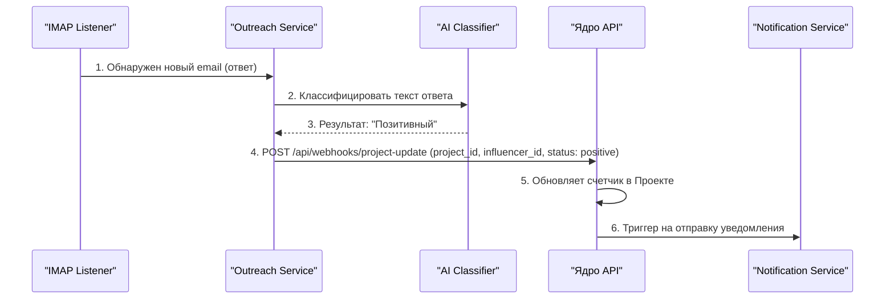

### 5. Программные интерфейсы (API)
Этот раздел определяет структуру данных и "контракты" взаимодействия между модулями системы. Он служит основой для разработки и интеграции всех микросервисов.

#### 5.1. Модели данных (C5 - Level 4: Crumbs)
Ключевые сущности системы, которые будут представлены в базе данных PostgreSQL и транслироваться через API.

*   `Tenants` (Партнеры): Хранит информацию о White-Label партнерах, включая их настройки брендинга.
*   `Clients` (Клиенты): Пользователи, заказывающие кампании. Привязаны к `Tenants`.
*   `Projects` (Проекты): Основная рабочая сущность. Содержит все входные данные из квиза и отслеживает прогресс по цели.
*   `Influencers` (Инфлюенсеры): База инфлюенсеров с их метриками, контактами и семантическим вектором для поиска.
*   `Campaigns` (Кампании): Запись об отправке сообщений конкретному инфлюенсеру в рамках проекта. Отслеживает статус коммуникации.

#### 5.2. Ключевые процессы и API-взаимодействия (C5 - Level 3: Chunks)
Описание основных API-эндпоинтов, обеспечивающих работу пользовательских сценариев.

**5.2.1. Ядро API (Payload CMS)**
*   `POST /api/projects`: Создание нового проекта. Принимает данные из квиза, создает клиента (если новый), обрабатывает платеж через Stripe.
*   `GET /api/projects/:id`: Получение статуса и деталей проекта (для личного кабинета клиента).
*   `POST /api/projects/:id/start`: Внутренний эндпоинт для запуска проекта (триггерит вызовы к AI и Outreach сервисам).

**5.2.2. Сервис подбора и генерации (AI Service)**
*   `POST /api/match`: Принимает `prompt_data` из проекта. Возвращает массив `influencer_id`, отфильтрованных и отсортированных по релевантности.
*   `POST /api/generate`: Принимает `prompt_data` и один `influencer_id`. Возвращает готовую персонализированную email-цепочку.

**5.2.3. Сервис рассылок (Outreach Service)**
*   `POST /api/campaigns/start`: Принимает массив объектов `{influencer_id, email_sequence}`. Начинает рассылку.
*   `POST /api/campaigns/stop`: Останавливает все рассылки, связанные с указанным `project_id`.
*   `POST /api/webhooks/reply`: Внутренний эндпоинт, который вызывается при обнаружении ответа в почтовом ящике. Запускает классификацию и уведомляет Ядро API.

#### 5.3. Принципы проектирования API
Все API в системе должны следовать единым правилам для обеспечения консистентности и простоты интеграции.
*   **Стиль:** RESTful.
*   **Формат данных:** JSON (camelCase для ключей).
*   **Аутентификация:** Все запросы к внутренним API защищены с помощью Bearer-токенов (JWT) или API-ключей.
*   **Обработка ошибок:** Используются стандартные HTTP-коды состояния (200, 201, 400, 401, 403, 404, 500). Тело ответа при ошибке содержит `{ "error": { "code": "ERROR_CODE", "message": "Human-readable message" } }`.
*   **Версионирование:** Путь к API включает номер версии (например, `/api/v1/...`) для обеспечения обратной совместимости в будущем.
