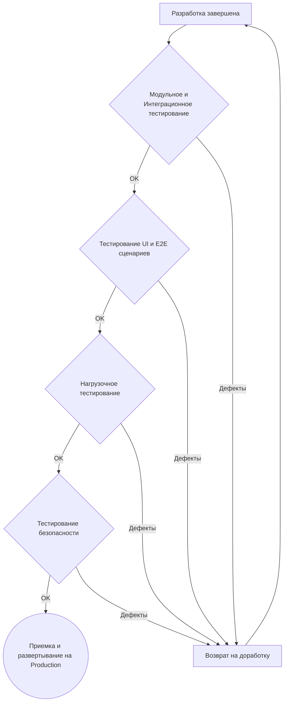

### **6. Процедура приемки**
Этот раздел определяет критерии и методы тестирования, которые будут использоваться для верификации соответствия разработанной платформы всем функциональным и нефункциональным требованиям, изложенным в данном документе.

#### **Общий процесс приемки**
Приемка осуществляется поэтапно. Каждый этап тестирования должен быть успешно пройден перед переходом к следующему. В случае обнаружения критических дефектов, система возвращается на доработку, после чего цикл тестирования для данного этапа повторяется.

#### **6.1. Функциональное тестирование**
**Цель:** Убедиться, что каждый компонент и система в целом корректно выполняют свою бизнес-логику.
*   **Модульное тестирование (Unit Tests):** Проверка отдельных функций и компонентов в изоляции. Покрытие кода unit-тестами должно составлять не менее 70% для критически важной бизнес-логики (например, классификатор ответов, логика подсчета лимитов).
*   **Интеграционное тестирование:** Проверка взаимодействия между микросервисами. Например, тест, который эмулирует создание Проекта в Ядре API и проверяет, что корректные вызовы были сделаны к AI Service и Outreach Service.

#### **6.2. Тестирование интерфейса и E2E**
**Цель:** Проверить корректность работы ключевых пользовательских сценариев от начала до конца через графический интерфейс.
*   **Метод:** Автоматизированные E2E-тесты (с использованием Playwright/Cypress) и ручное тестирование.
*   **Ключевые сценарии для проверки:**
    1.  Регистрация нового клиента, заполнение квиза, успешная оплата.
    2.  Отображение корректного статуса проекта в личном кабинете клиента.
    3.  Проверка работы панели администратора: создание/редактирование инфлюенсеров, ручной запуск кампании.
    4.  Корректность работы White-Label: проверка, что партнер видит только свои данные и свой брендинг.

#### **6.3. Нагрузочное тестирование**
**Цель:** Убедиться, что система соответствует нефункциональным требованиям к производительности и масштабируемости.
*   **Метод:** Использование инструментов (k6, JMeter) для эмуляции высокой нагрузки на API.
*   **Сценарий:**
    1.  Одновременная работа 50 виртуальных пользователей (клиентов).
    2.  Каждый пользователь создает 2 проекта.
    3.  Система должна обработать создание 100 проектов и запуск соответствующих кампаний в течение 10 минут.
    4.  Во время теста среднее время ответа API не должно превышать 200 мс (95-й перцентиль).

#### **6.4. Тестирование безопасности (Vulnerability Testing)**
**Цель:** Выявить и устранить базовые уязвимости в системе.
*   **Метод:** Автоматическое сканирование и ручная проверка.
*   **Чек-лист:**
    1.  Сканирование зависимостей на известные уязвимости (`npm audit`).
    2.  Проверка на соответствие OWASP Top 10 (SQL Injection, XSS, Broken Access Control).
    3.  Тестирование прав доступа: убедиться, что клиент А не может получить доступ к данным клиента Б, а партнер (тенант) А не видит данные партнера Б.
    4.  Проверка безопасности JWT-токенов (время жизни, корректная валидация).

---
**Критерии приемки:** Работа считается выполненной и готовой к развертыванию на production-окружении, когда все вышеперечисленные виды тестирования успешно пройдены, а Антон (заказчик) подтвердил работоспособность ключевых пользовательских сценариев на staging-окружении.
