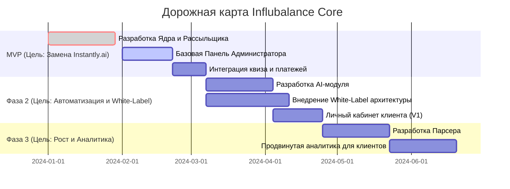

### **7. Заключение и План Реализации**
Техническое задание — это карта. Но даже у самой лучшей карты должен быть проложен маршрут с указанием первого шага и возможных опасностей на пути. Этот раздел определяет стратегию внедрения и ключевые риски.

#### **7.1. Приоритеты и MVP (Minimum Viable Product)**
Мы не строим всё и сразу. Наша первая цель — как можно быстрее получить работающий продукт, который решает главную боль Антона: зависимость от `Instantly.ai` и связанные с этим расходы.

**Цель MVP:** Убить `Instantly.ai` и перевести текущую операционку на свои рельсы.

**Состав MVP:**
1.  **Ядро API (Payload CMS):** Развертывание и настройка базовых моделей (Проекты, Инфлюенсеры).
2.  **Сервис рассылок (Outreach Service):** Основная логика отправки и трекинга ответов. Классификация на этом этапе может быть полуручной.
3.  **Панель Администратора:** Базовый интерфейс для управления кампаниями (запуск/остановка).
4.  **Простейший квиз:** Внедрение формы для приема новых заказов в новую систему.

**Что НЕ входит в MVP:** White-Label, продвинутая AI-генерация, личный кабинет клиента, парсер.

#### **7.2. Используемые материалы и артефакты**
Для успешной реализации проекта команда разработки должна получить доступ к следующим материалам:
*   **Дизайн и Прототипы:** Ссылка на интерактивный прототип в Figma, включающий все состояния UI-компонентов по методологии Atomic Design.
*   **Доступы к API:** Ключи для Stripe (в тестовом и боевом режимах), OpenAI, Telegram Bot API, Google/Microsoft Workspace для подключения почтовых ящиков.
*   **Брендбук:** Логотипы, цветовая палитра и шрифты для корректной настройки клиентского портала и White-Label решений.

#### **7.3. Ключевые риски и пути их митигации**
Любой план хорош до первого боя. Мы должны быть готовы к основным угрозам.

*   **Риск 1: "Ад доставляемости" (Deliverability Hell).**
    *   **Проблема:** Массовые рассылки с новых доменов/IP быстро попадают в спам-фильтры, что убивает всю эффективность.
    *   **Митигация:** Реализация системы "прогрева" почтовых ящиков, ротация IP-адресов и доменов, интеграция с сервисами мониторинга спам-рейтинга (например, Postmaster от Google), строгий контроль лимитов отправки.

*   **Риск 2: "Деградация AI-модели".**
    *   **Проблема:** Качество генерации текстов или классификации ответов со временем может снижаться или не соответствовать специфике новых ниш.
    *   **Митигация:** Внедрение в панель администратора системы фидбэка, где оператор может корректировать классификацию ("это был позитивный ответ, а не нейтральный"). Эти данные используются для периодического дообучения (fine-tuning) модели.

*   **Риск 3: "Хрупкость внешних API".**
    *   **Проблема:** Изменение API или правил со стороны Stripe, OpenAI или почтовых провайдеров может сломать часть функционала.
    *   **Митигация:** Весь код для взаимодействия с внешними API должен быть инкапсулирован в отдельные модули-"адаптеры". Это позволит при необходимости быстро заменить одну интеграцию на другую, не переписывая бизнес-логику.
