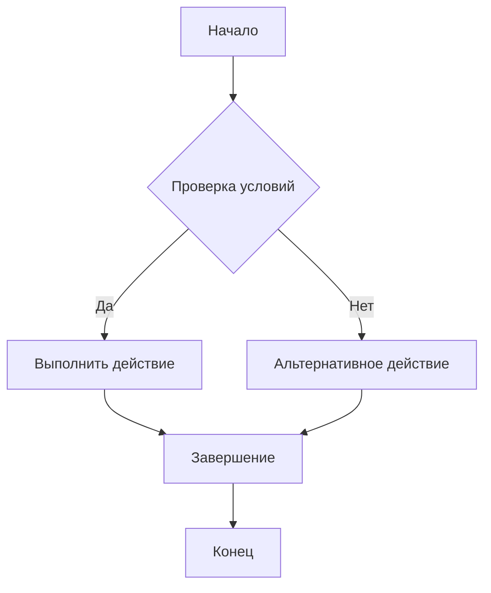
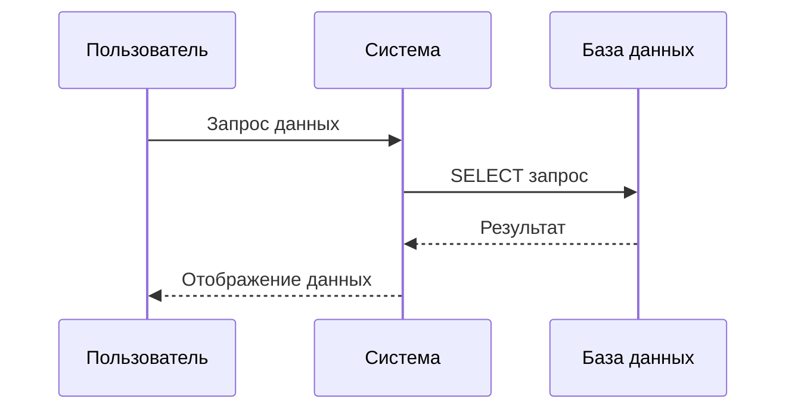
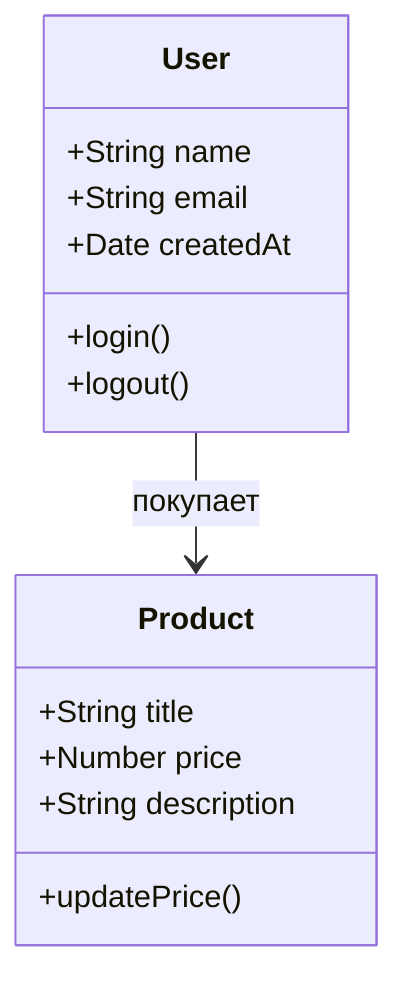
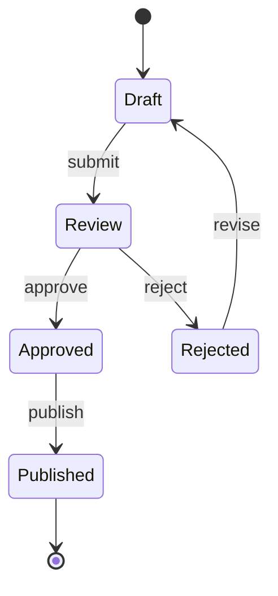
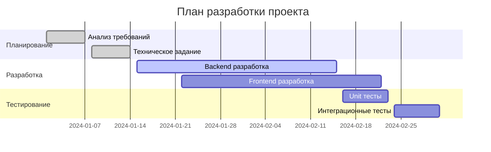
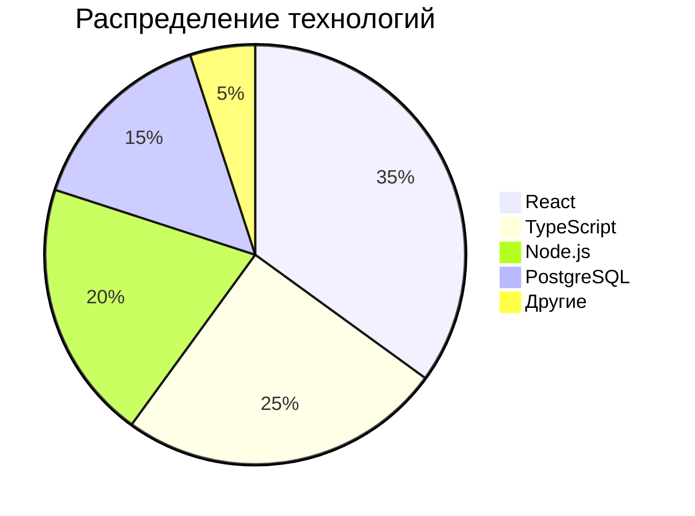
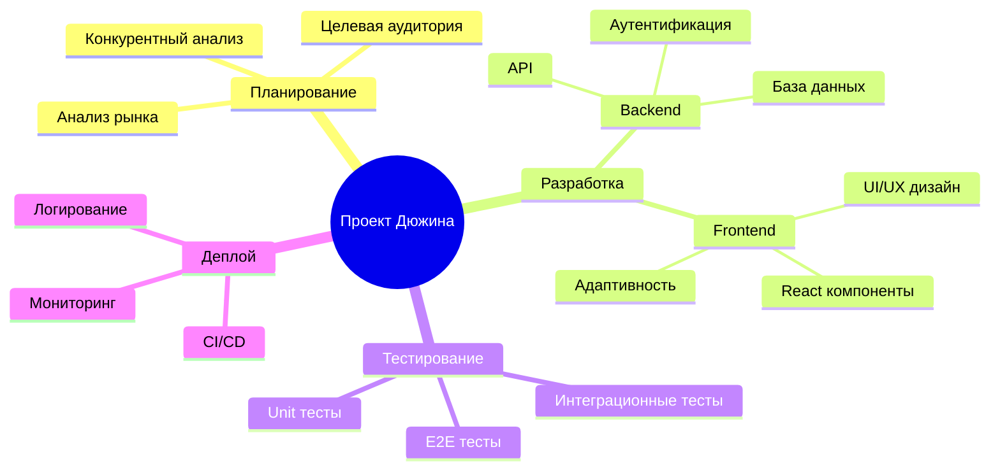
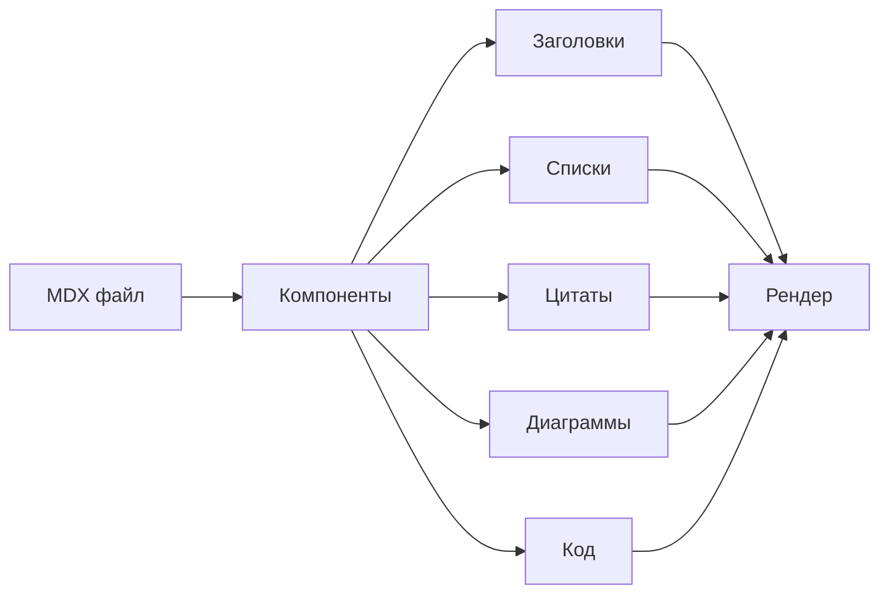

# Компоненты верстки

Демонстрация всех доступных компонентов для создания контента.

## Заголовки

### H1 заголовок (скрыт)
Этот заголовок скрыт по умолчанию для лучшего UX.

### H2 заголовок
Используется для основных разделов.

#### H3 заголовок
Для подразделов и группировки контента.

##### H4 заголовок
Для детализации и уточнений.

## Текст и параграфы

Это обычный параграф текста. Он содержит основную информацию и может быть любой длины. Текст автоматически переносится и имеет хорошую читаемость благодаря настроенным отступам и межстрочным интервалам.

**Жирный текст** используется для выделения важной информации.

*Курсивный текст* подчеркивает акценты или цитаты.

`Моноширинный текст` для кода, команд и технических терминов.

## Списки

### Маркированный список
- Первый элемент списка
- Второй элемент с **жирным текстом**
- Третий элемент с [ссылкой](https://example.com)
- Вложенный элемент
  - Подэлемент первого уровня
  - Еще один подэлемент

### Нумерованный список
1. Первый пункт
2. Второй пункт с *курсивом*
3. Третий пункт
   1. Подпункт
   2. Еще один подпункт

## Цитаты

> Это пример цитаты. Цитаты используются для выделения важных мыслей, цитирования источников или создания акцентов в тексте. Они имеют специальное оформление с левой границей и курсивным шрифтом.

> **Важная цитата с заголовком**
> 
> Эта цитата содержит дополнительную информацию и может быть многострочной.

## Ссылки

[Обычная ссылка](https://example.com) ведет на внешний сайт.

[Ссылка с описанием](https://example.com "Описание ссылки") имеет всплывающую подсказку.

## Код

### Инлайн код
Используйте `console.log()` для вывода в консоль.

### Блок кода
```javascript
function greetUser(name) {
  console.log(`Привет, ${name}!`);
  return `Добро пожаловать, ${name}`;
}

// Вызов функции
const message = greetUser('Пользователь');
```

```python
def calculate_sum(a, b):
    """Вычисляет сумму двух чисел"""
    return a + b

# Пример использования
result = calculate_sum(5, 3)
print(f"Результат: {result}")
```

## Диаграммы Mermaid

### Блок-схема процесса


### Диаграмма последовательности


### Диаграмма классов


### Диаграмма состояний


### Диаграмма Ганта


### Круговая диаграмма


### Ментальная карта


## Таблицы

| Компонент | Описание | Статус |
|-----------|----------|--------|
| Заголовки | H1-H6 элементы | ✅ Готово |
| Параграфы | Основной текст | ✅ Готово |
| Списки | Маркированные и нумерованные | ✅ Готово |
| Цитаты | Блочные цитаты | ✅ Готово |
| Ссылки | Внешние и внутренние | ✅ Готово |
| Код | Инлайн и блоки | ✅ Готово |
| Диаграммы | Mermaid диаграммы | ✅ Готово |
| Таблицы | Структурированные данные | ✅ Готово |

## Горизонтальная линия

---

## Комбинированный пример

> **Важное замечание о компонентах**
> 
> Все компоненты автоматически адаптируются под светлую и темную темы. Цветовая схема использует серые оттенки для создания профессионального вида.

### Использование в проекте

1. **Заголовки** - структурируют контент
2. **Списки** - организуют информацию
3. **Цитаты** - выделяют ключевые моменты
4. **Диаграммы** - визуализируют процессы
5. **Код** - демонстрируют технические решения



---

*Этот файл демонстрирует все доступные компоненты для создания богатого контента в MDX формате.*
