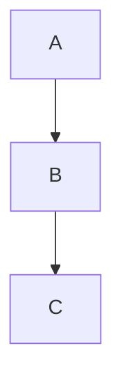
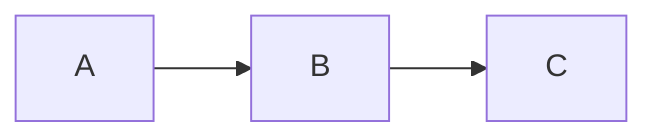
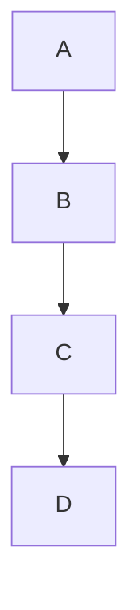
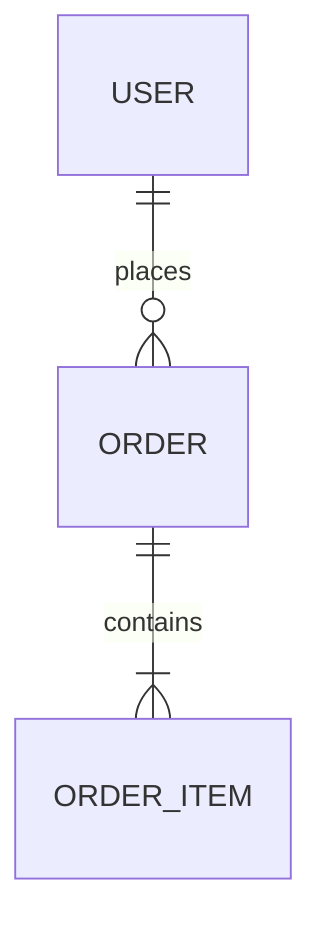
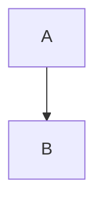

# Настройка Mermaid диаграмм

## Индивидуальные настройки для каждой диаграммы

### Использование комментариев в MDX

Вы можете настроить каждую диаграмму индивидуально, добавив комментарии в начале блока кода:



### Доступные настройки

| Настройка | Описание | Пример | По умолчанию |
|-----------|----------|--------|--------------|
| `zoom` | Включить/отключить зум | `%% zoom: true` | `true` |
| `height` | Высота контейнера | `%% height: 60vh` | `50vh` |
| `zoom-min` | Минимальный масштаб | `%% zoom-min: 0.5` | `0.2` |
| `zoom-max` | Максимальный масштаб | `%% zoom-max: 3` | `4` |
| `zoom-initial` | Начальный масштаб | `%% zoom-initial: 0.8` | `1` |
| `tooltip` | Текст всплывающей подсказки | `%% tooltip: Описание диаграммы` | Автоматически |
| `disable-tooltip` | Отключить всплывающую подсказку | `%% disable-tooltip: true` | `false` |

### Примеры использования

#### Диаграмма без зума


#### Диаграмма с увеличенной высотой


#### Компактная диаграмма


#### Диаграмма с настраиваемой подсказкой


#### Диаграмма без подсказки


#### Диаграмма с отключенным tooltip


#### Диаграмма с настраиваемой подсказкой


## Глобальные настройки

## Файл конфигурации: `src/lib/mermaid-config.ts`

### Основные настройки

#### 1. Настройки зума
```typescript
zoom: {
  enabled: true,        // Включить зум по умолчанию
  minScale: 0.2,        // Минимальный масштаб (20%)
  maxScale: 4,          // Максимальный масштаб (400%)
  initialScale: 1       // Начальный масштаб (100%)
}
```

#### 2. Настройки размеров
```typescript
sizing: {
  containerHeight: '50vh',    // Высота контейнера (50% экрана)
  maxSvgWidth: '100%',       // Максимальная ширина SVG
  maxSvgHeight: '100%'       // Максимальная высота SVG
}
```

#### 3. Настройки tooltip
```typescript
tooltip: {
  disabled: false,  // Отключить tooltip глобально
  defaultInteractiveText: 'Используйте колесико мыши для масштабирования...',
  defaultStaticText: 'Диаграмма без интерактивности'
}
```

#### 4. Правила отключения зума
```typescript
disableZoomRules: {
  disableForErDiagrams: true,     // Отключить зум для ER-диаграмм
  disableForSimpleDiagrams: true, // Отключить зум для простых диаграмм
  minNodesForZoom: 10,            // Минимальное количество узлов для зума
  disableForFirstNDiagrams: false, // Отключить зум для первых N диаграмм
  firstNDiagramsCount: 2,         // Количество первых диаграмм
  disableForKeywords: false,      // Отключить зум по ключевым словам
  keywords: ['simple', 'basic']   // Ключевые слова
}
```

### Примеры настройки

#### Отключить tooltip глобально
```typescript
export const defaultMermaidConfig: MermaidConfig = {
  tooltip: {
    disabled: true,  // Отключить tooltip для всех диаграмм
    defaultInteractiveText: 'Используйте колесико мыши для масштабирования...',
    defaultStaticText: 'Диаграмма без интерактивности'
  }
}
```

#### Отключить зум для всех диаграмм
```typescript
export const defaultMermaidConfig: MermaidConfig = {
  zoom: {
    enabled: false,  // Отключить зум полностью
    // остальные настройки не важны
  }
}
```

#### Изменить масштаб зума
```typescript
zoom: {
  enabled: true,
  minScale: 0.5,    // Минимум 50%
  maxScale: 2,      // Максимум 200%
  initialScale: 0.8 // Начальный масштаб 80%
}
```

#### Изменить высоту контейнера
```typescript
sizing: {
  containerHeight: '60vh',  // 60% экрана вместо 50%
  maxSvgWidth: '100%',
  maxSvgHeight: '100%'
}
```

#### Настроить правила отключения зума
```typescript
disableZoomRules: {
  disableForErDiagrams: false,      // Включить зум для ER-диаграмм
  disableForSimpleDiagrams: true,   // Отключить зум для простых
  minNodesForZoom: 5,               // Минимум 5 узлов для зума
  disableForFirstNDiagrams: true,   // Отключить зум для первых 3
  firstNDiagramsCount: 3,
  disableForKeywords: true,         // Отключить зум по словам
  keywords: ['overview', 'summary'] // Ключевые слова
}
```

### Применение изменений

После изменения конфигурации:
1. Сохраните файл `src/lib/mermaid-config.ts`
2. Обновите страницу в браузере
3. Изменения применятся автоматически

### CSS настройки

Дополнительные стили можно настроить в `src/app/globals.css`:

```css
.mermaid-diagram-container {
  height: 50vh;  /* Изменить высоту контейнера */
}

.zoom-controls {
  top: 3px;      /* Позиция кнопок зума */
  right: 3px;
}
```
